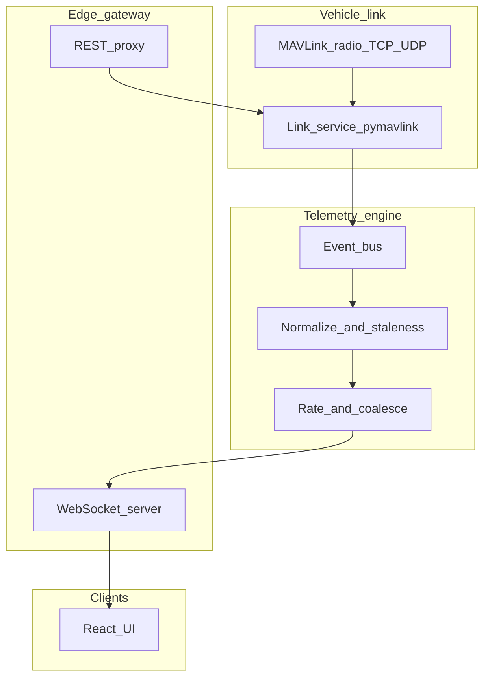

# MASTER GCS ARCHITECTURE DOCUMENT
**Status**: Production. Last updated: 2026-05-27.
**Scope**: Full system architecture — layers, data flows, telemetry pipeline, connection system, state management, and design target.
**Supersedes**: `MODERN_GCS_ARCHITECTURE.md`, `GCS_DOCUMENTATION.md` (architecture sections), `telemetry-engine-design.md`, `vehicle-state-schema.md`, `mavlink-ingestion.md`, `vehicle-state-model.md`, `currentstate-architecture.md`, `telemetry-flow.md`, `telemetry-state-flow.md`, `hud-architecture.md`, `event-bus-design.md`, `migration-roadmap.md`, `MODERN_GCS_ARCHITECTURE.md`

---

## TABLE OF CONTENTS

1. [System Overview](#1-system-overview)
2. [Layer-by-Layer Architecture](#2-layer-by-layer-architecture)
3. [Telemetry Pipeline (MAVLink → UI)](#3-telemetry-pipeline-mavlink--ui)
4. [Vehicle State Schema](#4-vehicle-state-schema)
5. [Connection System](#5-connection-system)
6. [Command Pipeline](#6-command-pipeline)
7. [Mission Planner Parity: Architecture Comparison](#7-mission-planner-parity-architecture-comparison)
8. [Gaps and Design Target](#8-gaps-and-design-target)
9. [File Index](#9-file-index)

---

## 1. SYSTEM OVERVIEW

Drone GCS is a ground control station for ArduPilot drones targeting **Mission Planner parity**.

```
Browser (React + Zustand)
  │
  ├── useMissionStore  — waypoints, missionType, fence mode
  ├── useTelemetryStore — vehicle state, ADSB, telemetry
  │
  └─── HTTP + WebSocket ──► Node Express (port 8080)
                                │
                         ZMQ SUB  /api/* proxy ──► FastAPI (port 8000)
                                                        │
                                                   pymavlink ──► Drone (UDP/TCP/Serial)
```

### Stack Summary

| Layer | Location | Role |
|-------|-----------|------|
| **Frontend** | `drone_gcs/frontend/` (React, Vite) | Pages (Flight Data, Planner, Params, Setup, Simulation), `AdvancedHUD`, `MapView`/`MapEditor`, Zustand stores |
| **API gateway** | `drone_gcs/node_api/server.js` (Express) | HTTP :8080 REST proxy to Python; WebSocket fan-out; ZeroMQ subscriber `tcp://127.0.0.1:5556` → broadcast JSON to browsers |
| **Telemetry / MAVLink** | `drone_gcs/python_service/` (FastAPI, asyncio, pymavlink) | `LinkManager` (connect, read loop, reconnect, commands), `VehicleState` dataclass, `message_handlers.handle_message`, `TelemetryPublisher` ZMQ PUB |
| **Cross-cutting** | ZMQ bridge | Python PUB → Node SUB → WS clients |

### Ports

| Service | Port |
|---------|------|
| Frontend dev server | 5173 |
| Node gateway | 8080 |
| Python FastAPI | 8000 |
| ZMQ PUB (Python → Node) | 5556 |

---

## 2. LAYER-BY-LAYER ARCHITECTURE

### 2.1 Python Service (FastAPI + pymavlink)

```
mavlink_link.py (652 LOC)
  ├── LinkManager
  │     ├── connect() — serial/UDP/TCP open, DTR/RTS settle
  │     ├── read_loop() — asyncio: recv_match → handle_message → state
  │     ├── keep_alive_loop() — sends GCS heartbeat at 1 Hz (MAV_TYPE_GCS)
  │     ├── _bootstrap_session() — handshake, stream requests, EKF origin
  │     ├── _attempt_reconnect() — reconnect state machine
  │     ├── set_mode(sysid, mode) — set_mode_send(custom_mode) only, no ACK wait
  │     └── command_long_send() — sends raw MAVLink command
  │
message_handlers.py (188 LOC)
  ├── handle_message(msg, state)
  │     ├── HEARTBEAT → state.status.{armed, mode, system_type}
  │     ├── ATTITUDE → state.attitude.{roll, pitch, yaw} (radians from MAVLink)
  │     ├── GLOBAL_POSITION_INT → state.position.{lat, lng, alt_amsl, alt_rel}
  │     ├── VFR_HUD → state.velocity.{airspeed, groundspeed, climb, heading, throttle}
  │     ├── GPS_RAW_INT → state.status.{gps_fix, satellites, gps_hdop, gps_vdop}
  │     ├── SYS_STATUS → state.status.battery_*
  │     ├── EKF_STATUS_REPORT → state.status.ekf_*
  │     ├── VIBRATION → state.status.vibration_{x,y,z}
  │     ├── MISSION_CURRENT → state.mission_current_seq = int(msg.seq)  ← verbatim, no masking
  │     ├── NAV_CONTROLLER_OUTPUT → state.navigation.{wp_dist, nav_bearing, xtrack}
  │     ├── HOME_POSITION → state.home.{lat, lng, alt_m, valid}
  │     ├── STATUSTEXT → state.status_messages (ring of 50) + fence_status.last_breach_text
  │     ├── FENCE_STATUS → state.fence_status.{breach_status, breach_type, breach_count}
  │     └── PARAM_VALUE → parameter_manager.handle_param_value()
  │
vehicle_state.py (242 LOC)
  ├── VehicleState dataclass — sole authoritative Python model
  └── to_dict() — serializes to JSON for ZMQ broadcast
  
command_manager.py
  └── execute_command(sysid, compid, cmd, p1..p7) — COMMAND_LONG + ACK wait + retries
        ARM/DISARM: 10 s timeout
        Others: 3 s timeout, 3 retries
        
parameter_manager.py
  └── fetch_all() — PARAM_REQUEST_LIST → PARAM_VALUE
      set_parameter_verified() — PARAM_SET + ACK + 3× retry

mission_manager.py
  └── _inject_home() — prepends HOME at seq 0 for MISSION type only
      upload_mission(items, mission_type) — MISSION_COUNT → loop REQUEST_INT/ITEM_INT → ACK
      download_mission(mission_type) — REQUEST_LIST → MISSION_COUNT → REQUEST_INT loop
      transfer_status — 10 Hz progress dict

telemetry_pub.py
  └── TelemetryPublisher — publishes VehicleState.to_dict() via ZMQ PUB at loop rate
```

### 2.2 Node API (Express)

```
node_api/server.js
  ├── ZMQ SUB ──► telemetryEngine.js → vehicleStateManager.js → eventBus.js
  │               staleTelemetry.js (per-field TTL)
  │
  ├── /api/state            — REST snapshot
  ├── /api/command/:cmd     — SHORTCUT MAP (arm, disarm, rtl, land, takeoff, mission_start, pause, continue)
  │                           → forwards to Python /command
  ├── /api/mode             — pure proxy to Python /mode
  ├── /api/flyto            — proxy to Python /flyto
  ├── /api/vehicle/*        — set_home, roi
  ├── /api/parameters/*     — proxy to Python parameters
  ├── /api/mission, /api/fence, /api/rally — proxy to Python
  └── WebSocket server      — broadcasts all ZMQ messages to connected browsers

COMMAND_SHORTCUTS (node_api/server.js:210-220):
  'arm':          { command: 400, p1: 1 }          // MAV_CMD_COMPONENT_ARM_DISARM
  'force_arm':    { command: 400, p1: 1, p2: 21196 }
  'disarm':       { command: 400, p1: 0 }
  'rtl':          { command: 20 }                   // MAV_CMD_NAV_RETURN_TO_LAUNCH
  'land':         { command: 21 }
  'takeoff':      { command: 22, p7: 10 }           // default 10m
  'mission_start':{ command: 300 }
  'pause':        { command: 193, p1: 0 }
  'continue':     { command: 193, p1: 1 }
```

### 2.3 Frontend (React + Zustand)

```
pages/
  FlightData.jsx (470 LOC)     — primary live-flight view: HUD + map + tabs
  FlightPlanner.jsx             — mission/fence drawing, writing, execution control
  Setup.jsx                     — calibration + parameters
  Simulation.jsx                — SITL control
  Params.jsx                    — full parameter browser

components/
  AdvancedHUD.jsx (437 LOC)    — attitude, speed, altitude, GPS, EKF, STATUSTEXT toasts
  MapView.jsx (877 LOC)        — live flight map (Data tab)
  MapEditor.jsx                — mission drawing map (Flight Planner tab)
  MissionExecutionPanel.jsx    — mission progress, MISSION COMPLETE / UNPLANNED RETURN banners
  tabs/
    ActionsTab.jsx, QuickTab.jsx, StatusTab.jsx, GaugesTab.jsx
    MessagesTab.jsx, PreFlightTab.jsx, ServoTab.jsx, AuxTab.jsx

store/
  useTelemetryStore.js (321 LOC)  — primary telemetry SoT
  useMissionStore.js (217 LOC)    — mission/fence/rally per-type buffers

telemetry/
  telemetryWebSocketBridge.js   — inbound WS frames → Zustand
  telemetrySyncReducer.js       — reducer
  telemetrySelectors.js         — derived values
  (+ parameterSelectors, missionSelectors, preflightSelectors, commandSelectors, mapSelectors)
```

---

## 3. TELEMETRY PIPELINE (MAVLINK → UI)

```
Vehicle (ArduPilot)
  │ MAVLink (UDP 14550 / serial)
  ▼
mavlink_link.py: read_loop()
  │ recv_match() → handle_message(msg, VehicleState)
  ▼
VehicleState (Python dataclass)
  │ to_dict() → JSON
  ▼
telemetry_pub.py: TelemetryPublisher
  │ ZMQ PUB tcp://127.0.0.1:5556
  ▼
node_api/telemetry/telemetryEngine.js
  │ ZMQ SUB → process → vehicleStateManager.js → eventBus.js
  ▼
node_api/server.js: WebSocket
  │ broadcasts to all connected browsers
  ▼
frontend/telemetry/telemetryWebSocketBridge.js
  │ WS message → telemetrySyncReducer.js → Zustand merge
  ▼
useTelemetryStore (Zustand)
  │ selectors derive HUD values, map position, etc.
  ▼
React components (AdvancedHUD, MapView, StatusTab, etc.)
```

### 3.1 MAVLink → VehicleState Field Mapping

| MAVLink Message | Python Handler | VehicleState Field | Frontend Consumer |
|-----------------|---------------|-------------------|-------------------|
| `HEARTBEAT` | `message_handlers.py:37-51` | `status.{armed, mode, system_type}` | HUD armed/mode, all state machines |
| `ATTITUDE` | `:87-90` | `attitude.{roll, pitch, yaw}` (rad) | HUD horizon, roll arc |
| `GLOBAL_POSITION_INT` | `:92-105` | `position.{lat, lng, alt_amsl, alt_rel}` | HUD alt tape, map marker |
| `VFR_HUD` | `:122-127` | `velocity.{airspeed, groundspeed, climb, heading, throttle}` | HUD speed tape, VSI |
| `GPS_RAW_INT` | `:81-85` | `status.{gps_fix, satellites, gps_hdop}` | HUD GPS pill |
| `SYS_STATUS` | `:53-61` | `status.battery_*`, sensor bitmasks | StatusTab battery |
| `EKF_STATUS_REPORT` | `:129-135` | `status.ekf_*` | HUD EKF pill |
| `VIBRATION` | `:137-143` | `status.vibration_{x,y,z}` | HUD vibe chip (>30 m/s² threshold) |
| `MISSION_CURRENT` | `:119-120` | `mission.current_seq` | MissionExecutionPanel, FlightPlanner WP counter |
| `NAV_CONTROLLER_OUTPUT` | `:158-161` | `navigation.{wp_dist, nav_bearing}` | StatusTab, HUD (WP dist not on HUD yet) |
| `HOME_POSITION` | `:106-110` | `home.{lat, lng, alt_m, valid}` | Map home marker |
| `STATUSTEXT` | `:163-168` | `status_messages` (ring of 50), `fence_status.last_breach_text` | MessagesTab, AdvancedHUD toasts |
| `FENCE_STATUS` | `:183-190` | `fence_status.{breach_status, breach_type, breach_count}` | FlightPlanner diagnostics |
| `PARAM_VALUE` | `:180-187` | `parameters` dict | Params page, QuickTab |

### 3.2 STATUSTEXT Toast Severity (Post-Fix)

`AdvancedHUD.jsx STATUSTEXT_TOAST_SEVERITY = 4`:
- Severity ≤ 4 → always toast
- **Any message containing `fence`, `breach`, or `failsafe`** → also toast, regardless of severity (painted red, labelled "FENCE")

This ensures NOTICE (severity 5) fence breach messages — which ArduPilot emits for polygon breaches — are never silently filtered.

---

## 4. VEHICLE STATE SCHEMA

### 4.1 Top-Level JSON Shape (from `vehicle_state.to_dict()`)

```json
{
  "schema_version": "2026.1",
  "sysid": 1,
  "compid": 1,
  "connection_state": "CONNECTED",
  "position": {
    "lat": 17.456979,
    "lng": 78.372855,
    "alt_amsl": 510.3,
    "alt_rel": 12.4
  },
  "attitude": {
    "roll": -0.023,
    "pitch": 0.015,
    "yaw": 1.57
  },
  "velocity": {
    "airspeed": 0.0,
    "groundspeed": 5.3,
    "climb": 0.2,
    "heading": 90.0,
    "throttle": 600
  },
  "status": {
    "armed": true,
    "mode": "AUTO",
    "gps_fix": 3,
    "satellites": 12,
    "gps_hdop": 0.8,
    "battery_voltage": 12.4,
    "battery_current": 14.2,
    "battery_remaining": 74,
    "ekf_flags": 511,
    "ekf_velocity_variance": 0.1,
    "ekf_pos_horiz_variance": 0.12
  },
  "home": {
    "lat": 17.456979,
    "lng": 78.372855,
    "alt_m": 500.0,
    "valid": true
  },
  "mission": {
    "current_seq": 2,
    "total": 5
  },
  "fence_status": {
    "breach_status": 0,
    "breach_type": 0,
    "breach_count": 0,
    "last_breach_text": ""
  },
  "status_messages": [
    { "severity": 6, "text": "ArduCopter V4.3.7", "timestamp": 1748350799.0 }
  ],
  "parameters": { "FENCE_ENABLE": 0, ... }
}
```

### 4.2 Known Unit Issue

`attitude.{roll, pitch, yaw}` are in **radians** (as received from MAVLink `ATTITUDE`). The HUD converts them to degrees inline. Mission Planner stores degrees in `CurrentState`. A future schema version should expose `*_deg` fields or document the unit explicitly.

### 4.3 Connection States

```
DISCONNECTED
   │ connect()
   ▼
CONNECTING
   │ transport opened
   ▼
WAITING_FOR_HEARTBEAT
   │ heartbeat received + ≥2 telemetry streams
   ▼
CONNECTED  ◄────────────────┐
   │ HB age > 3.0 s         │ heartbeat resumes
   ▼                        │
HEARTBEAT_LOST              │
   │ _attempt_reconnect()   │
   ▼                        │
RECONNECTING ───────────────┘

Note: ACTIVE state is defined in enum but never set — vestigial dead code.
```

---

## 5. CONNECTION SYSTEM

### 5.1 Supported Transports

| Transport | Frontend selector | Status |
|-----------|-------------------|--------|
| Serial (USB / FTDI) | Live `/api/connection/ports` poll every 5 s | ✓ |
| UDP client (e.g. `udp:127.0.0.1:14550`) | Preset | ✓ |
| TCP client (e.g. `tcp:127.0.0.1:5760`) | Preset | ✓ |
| Bluetooth serial | Preset (DTR/RTS toggles) | ✓ |
| UDP server / forwarding | `DRONE_UDP_FORWARD` env var only | Partial |
| Saved profiles | — | Missing |

### 5.2 Connection Handshake

`mavlink_link.py:_bootstrap_session()`:
1. Open transport
2. Send GCS heartbeat (MAV_TYPE_GCS)
3. Wait for vehicle heartbeat — extract sysid
4. Send stream requests (DATA_STREAM_ALL at requested rate)
5. Wait for ≥ 2 telemetry streams (GLOBAL_POSITION_INT, ATTITUDE etc.)
6. Declare CONNECTED

### 5.3 Heartbeat Keepalive

`keep_alive_loop()` (mavlink_link.py:lines ~471-492): sends GCS heartbeat at **1 Hz** as an asyncio task. Started at lines 223-224. Ensures the vehicle knows the GCS is still connected (prevents GCS failsafe).

Heartbeat timeout: **3.0 s** — if no vehicle heartbeat received in 3 s, transitions to HEARTBEAT_LOST → RECONNECTING.

### 5.4 Connection Gaps

| Gap | Impact |
|-----|--------|
| No exponential backoff (fixed 1.0 s retry) | Hammers reconnect on serial loss |
| No max-reconnect-attempt cap | Retries forever |
| No reason-coded errors | Timeout vs port-not-found vs handshake-fail all look the same |
| Param re-sync on reconnect not implemented | Parameters assumed unchanged across reconnect |
| `ACTIVE` enum state never set | Dead code |

---

## 6. COMMAND PIPELINE

### 6.1 End-to-End: ARM Example

```
ActionsTab.jsx:69       axios.post('/api/command/arm', {})
                               │
node_api/server.js:236  app.post('/api/command/:cmd')
                        → look up COMMAND_SHORTCUTS['arm'] = { command: 400, p1: 1 }
                        → POST PYTHON_API_URL + '/command'
                               │
python main.py:527      send_command()
                        → link_manager.send_command(sysid, compid, 400, 1, 0,…)
                               │
command_manager.py:46   COMMAND_LONG send → wait COMMAND_ACK
                        → 10 s timeout (ARM/DISARM), 3 s others, 3 retries
                               │
mavlink_link.py:480     command_long_send (pymavlink)
                        → MAVLink to vehicle
```

### 6.2 API Endpoints (Complete Reference)

| Method | Path | Description |
|--------|------|-------------|
| GET | `/api/mission` | Download MISSION items |
| POST | `/api/mission/upload` | Upload MISSION items |
| GET | `/api/fence` | Download FENCE items |
| POST | `/api/fence/upload` | Upload FENCE items |
| GET | `/api/fence/status` | Read FENCE_ENABLE, FENCE_ACTION, etc. |
| POST | `/api/fence/config` | Write fence parameters |
| GET | `/api/rally` | Download RALLY items |
| POST | `/api/rally/upload` | Upload RALLY items |
| GET | `/api/mission/transfer/status` | Live transfer progress |
| POST | `/api/command/:cmd` | Shortcut commands (arm, disarm, rtl, land, takeoff, mission_start, pause, continue) |
| POST | `/api/mode` | Set flight mode |
| POST | `/api/flyto` | Set GUIDED mode target |
| POST | `/api/vehicle/set_home` | Set home position |
| POST | `/api/vehicle/roi` | Set region of interest |
| POST | `/api/mavlink/command` | Raw MAVLink command (MAV_CMD_*) |
| GET | `/api/telemetry` | Full vehicle telemetry state |
| GET | `/api/connection/ports` | List available serial ports |
| POST | `/api/connection/start` | Connect to vehicle |
| POST | `/api/connection/stop` | Disconnect |
| GET | `/api/parameters` | Fetch all parameters |
| POST | `/api/parameters/:id` | Set a parameter |
| GET | `/api/vehicles` | List known vehicles (multi-drone) |

---

## 7. MISSION PLANNER PARITY: ARCHITECTURE COMPARISON

| Mission Planner (C#) | Drone GCS | Notes |
|---------------------|-----------|-------|
| `MAVLinkInterface.readPacketAsync` + `processInfoFromStream` | `LinkManager` read loop + `handle_message` | Structurally equivalent |
| `MAVState` + `CurrentState` per sys/comp | `VehicleState` per `sysid` in `link_manager.vehicles` | MP splits telemetry (CurrentState) from protocol state (MAVState); we merge into one VehicleState |
| `OnPacketReceived` → giant `CurrentState` switch | Incremental `handle_message` per message type | Our handler is more modular |
| WinForms `BindingSource.UpdateDataSource` ~10 Hz | ZMQ snapshot → Node → WS → Zustand merge | Functional equivalent via ZMQ PUB |
| HUD bound to `CurrentState` fields | `AdvancedHUD` consumes nested `vehicle` snapshot | Same 10 Hz update pattern |
| `UpdateCurrentSettings` (stream requests, timers) | Split across `_bootstrap_session`, `read_loop`, `_attempt_reconnect` | Fragmented — should be a single helper |
| `MAVState.packets` / `packetsLast` per msgid | Not mirrored; `message_counts` exists on link | Gap for tooling/plugins |
| `wpno = wpcur.seq` in `CurrentState.cs:3403` | `state.mission_current_seq = int(msg.seq)` | Verbatim, no masking — **parity confirmed** |
| ARM retry via STABILIZE when rejected by mode | `ActionsTab.jsx` ARM auto-retry | ✓ Better than MP — explicit with status feedback |
| `MAV_CMD_MISSION_START` params `p1=0, p2=0` (`LayoutEditor.cs:552`) | `p1=0, p2=0` (`server.js:293`) | ✓ Parity |

---

## 8. GAPS AND DESIGN TARGET

### 8.1 Architecture Gaps

| # | Gap | Impact | Priority |
|---|-----|--------|---------|
| A1 | Attitude stored in radians; HUD converts inline rather than normalizing at ingestion | Inconsistency if any other consumer reads raw field | Low |
| A2 | Stream-request logic split across 3 call sites | Reconnect sometimes misses stream requests | Medium |
| A3 | `ACTIVE` connection state enum value defined but never set | Dead code confusion | Low |
| A4 | Heartbeat sent in both bootstrap AND keep_alive_loop | Potential duplicate sends in CONNECTING state | Low |
| A5 | Parameters not auto-fetched after connect | Fence diagnostics, preflight alt checks see `{}` until user visits Params tab | Medium |
| A6 | No event schema versioning on ZMQ/WS | Breaking ZMQ payload changes will silently corrupt frontend | Medium |

### 8.2 Design Target (Conceptual)

The target architecture aligns with Mission Planner's layered model:



Key improvements over current state:
- **Normalized attitude units** at ingestion (degrees, not radians)
- **Per-field staleness metadata** (`last_rx`, `stale_after_ms`)
- **Schema version** in every ZMQ envelope
- **Delta channel** alongside full snapshot for efficiency
- **Single `_request_all_streams(target)` helper** instead of 3 call sites

---

## 9. FILE INDEX

### Frontend

| File | Role |
|------|------|
| `drone_gcs/frontend/src/pages/FlightData.jsx` | Primary live-flight view |
| `drone_gcs/frontend/src/pages/FlightPlanner.jsx` | Mission/fence planning |
| `drone_gcs/frontend/src/components/AdvancedHUD.jsx` | HUD (attitude, speed, alt, GPS, EKF, toasts) |
| `drone_gcs/frontend/src/components/MapView.jsx` | Live flight map |
| `drone_gcs/frontend/src/components/MapEditor.jsx` | Mission drawing map |
| `drone_gcs/frontend/src/components/MissionExecutionPanel.jsx` | Mission progress panel |
| `drone_gcs/frontend/src/store/useTelemetryStore.js` | Primary telemetry store |
| `drone_gcs/frontend/src/store/useMissionStore.js` | Mission/fence/rally store |
| `drone_gcs/frontend/src/telemetry/telemetryWebSocketBridge.js` | WS → Zustand |
| `drone_gcs/frontend/src/utils/TelemetryRegistry.js` | QuickTab telemetry key registry |

### Node API

| File | Role |
|------|------|
| `drone_gcs/node_api/server.js` | Main Express server, WS, ZMQ SUB, REST proxy |
| `drone_gcs/node_api/telemetry/telemetryEngine.js` | ZMQ message processing |
| `drone_gcs/node_api/telemetry/vehicleStateManager.js` | Vehicle state tracking |
| `drone_gcs/node_api/telemetry/staleTelemetry.js` | Per-field TTL staleness |
| `drone_gcs/node_api/telemetry/eventBus.js` | Internal event bus |

### Python Service

| File | Role |
|------|------|
| `drone_gcs/python_service/main.py` (1295 LOC) | All REST endpoints |
| `drone_gcs/python_service/mavlink_link.py` (652 LOC) | Transport, heartbeat, reconnect |
| `drone_gcs/python_service/message_handlers.py` (188 LOC) | Per-MAVLink-msg handlers |
| `drone_gcs/python_service/vehicle_state.py` (242 LOC) | `VehicleState` dataclass |
| `drone_gcs/python_service/command_manager.py` | ACK + timeout + retry |
| `drone_gcs/python_service/parameter_manager.py` | PARAM_REQUEST/SET + cache |
| `drone_gcs/python_service/mission_manager.py` | upload/download/status |
| `drone_gcs/python_service/connection_manager.py` | Port enum + auto-detect |
| `drone_gcs/python_service/telemetry_pub.py` | ZMQ PUB of VehicleState |
| `drone_gcs/python_service/sitl_manager.py` | SITL process management |
| `drone_gcs/python_service/sitl_orchestrator.py` | SITL orchestration |
| `drone_gcs/python_service/adsb_store.py` | ADS-B traffic |
| `drone_gcs/python_service/replay_manager.py` | Telemetry replay backend |
