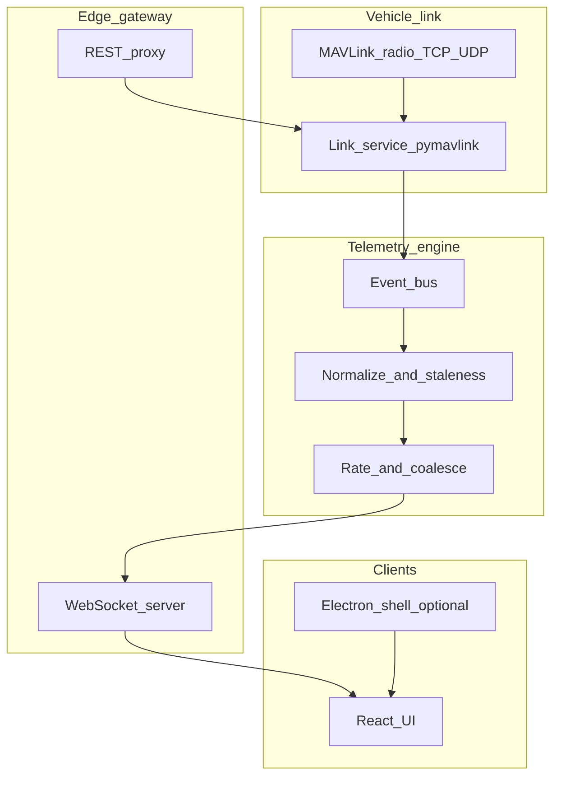

# Modern GCS architecture (target design)

**Scope:** Architecture vision for evolving **Drone-System-Collab** (`drone_gcs`) toward a Mission Planner–inspired, web-era stack **without** changing the repository layout in this document. **No code, no new folders, no scaffolding** — design only.

**Reference analyses (Mission Planner patterns):** [`hud-architecture.md`](hud-architecture.md), [`telemetry-flow.md`](telemetry-flow.md), [`currentstate-architecture.md`](currentstate-architecture.md), [`telemetry-state-flow.md`](telemetry-state-flow.md), [`mavlink-ingestion.md`](mavlink-ingestion.md), [`vehicle-state-model.md`](vehicle-state-model.md).

---

## 1. Current Drone-System-Collab architecture (as-is summary)

| Layer | Location | Role |
|-------|-----------|------|
| **Frontend** | `drone_gcs/frontend/` (React, Vite) | Pages (Flight Data, Planner, Params, Setup, Simulation, OSD…), `AdvancedHUD`, `MapView` / `MapEditor`, Zustand stores (`useTelemetryStore`, `useMissionStore`), axios to Node |
| **API gateway** | `drone_gcs/node_api/server.js` (Express, **ws**) | HTTP 8080: REST proxy to Python; **WebSocket** fan-out; **ZeroMQ** subscriber `tcp://127.0.0.1:5556` → broadcast JSON to browsers |
| **Telemetry / MAVLink service** | `drone_gcs/python_service/` (FastAPI, asyncio, pymavlink) | `LinkManager` (connect, read loop, reconnect, commands), `VehicleState` dataclass, `message_handlers.handle_message`, `TelemetryPublisher` ZMQ PUB **10 Hz**, mission/param/SITL/OSD modules |
| **Cross-cutting** | ZMQ bridge | Python PUB → Node SUB → WS clients (coarse “event bus” today) |

Detailed breakdowns: [`telemetry-engine-design.md`](telemetry-engine-design.md), [`frontend-sync-architecture.md`](frontend-sync-architecture.md), [`vehicle-state-schema.md`](vehicle-state-schema.md).

---

## 2. Mission Planner concepts vs Drone-System-Collab

| Mission Planner (C#) | Drone-System-Collab (current) |
|----------------------|-------------------------------|
| `MAVLinkInterface.readPacketAsync` + `processInfoFromStream` | `LinkManager` read loop + `handle_message` + separate `MissionManager` / `ParameterSyncManager` |
| `MAVState` + `CurrentState` per sys/comp | `VehicleState` per `sysid` in `link_manager.vehicles`; primary `primary_sysid` |
| `OnPacketReceived` → giant `CurrentState` switch | Incremental `handle_message` mapping |
| WinForms `BindingSource.UpdateDataSource` ~10 Hz | ZMQ snapshot 10 Hz → Node → WS → Zustand merges |
| HUD bound to `CurrentState` fields | `AdvancedHUD` consumes nested `vehicle` snapshot |
| `UpdateCurrentSettings` (link %, stream requests, timers) | Partially in `LinkManager` (heartbeat, reconnect); no single “housekeeping” twin |
| `MAVState.packets` / `packetsLast` per msgid | Not mirrored; `message_counts` exists on link |

---

## 3. Gaps and risks

- **Missing telemetry abstractions:** No versioned **telemetry schema**, no per-field **staleness** / `last_heard` metadata at the edge; ATTITUDE stored in radians in `VehicleState` while UI may assume degrees (document and normalize in a future engine layer).
- **Weak coupling areas:** Zustand merges by convention (`payload.type` strings); no central **event bus contract** (see [`event-bus-design.md`](event-bus-design.md)).
- **Scalability:** Node process is a **single fan-out**; multi-tenant / multi-GCS / horizontal scale not modeled.
- **Multi-drone:** Backend has `vehicles` map; UI often **primary**-centric; Mission Planner explicitly iterates all MAVs for housekeeping.
- **Plugin architecture:** Mission Planner plugins + script hooks; Drone GCS is monolithic React + fixed Python modules.
- **Event-driven state:** Ingest is asyncio + polling `recv_match`; UI is push via 10 Hz full snapshots — not fine-grained domain events.

---

## 4. Target architecture (conceptual stack)

**Clients:** React UI (optionally packaged with **Electron** for desktop: serial permissions, auto-updater, single-window shell — *packaging choice*, not a second app logic fork).

**Realtime plane:**

1. **Telemetry engine** (Node or Rust/Go *optional future*): WebSocket or WSS to clients; internal **event bus** (see [`event-bus-design.md`](event-bus-design.md)); **modular services** (ingestion, dedupe, staleness, rate control).
2. **MAVLink link service** (Python acceptable to retain pymavlink): produces **normalized vehicle state** + **domain events** (`ATTITUDE_UPDATED`, `PARAM_VALUE`, …) instead of only full JSON blobs.
3. **Optional bridge:** ZMQ or gRPC between link service and telemetry engine during migration (current ZMQ path is a valid interim).

**Control plane:** REST (or tRPC) for commands, params, mission CRUD — unchanged pattern from today’s FastAPI + Node proxy.

**State management (frontend):** Event-driven store (e.g. Zustand + middleware, or lightweight **event reducer**) subscribing to WS **envelopes** with schema version — see [`frontend-sync-architecture.md`](frontend-sync-architecture.md).

---

## 5. Dependency diagram (target)

---

## 6. Document map

| Document | Focus |
|----------|--------|
| [`telemetry-engine-design.md`](telemetry-engine-design.md) | Ingestion, normalization, rates, staleness, multi-drone |
| [`event-bus-design.md`](event-bus-design.md) | Topics, envelopes, ordering, backpressure |
| [`vehicle-state-schema.md`](vehicle-state-schema.md) | JSON/schema, units, per-field metadata |
| [`frontend-sync-architecture.md`](frontend-sync-architecture.md) | WS client, Zustand vs events, HUD/map sync |
| [`migration-roadmap.md`](migration-roadmap.md) | Phases, reuse, refactor vs rewrite |

---

## 7. Non-goals (this design pass)

- No new directory creation, no repo moves, no Electron boilerplate, no new microservices committed.
- Mission Planner C# code remains reference only; the product direction is **concept alignment**, not porting WinForms.

---

*Design-only document.*
