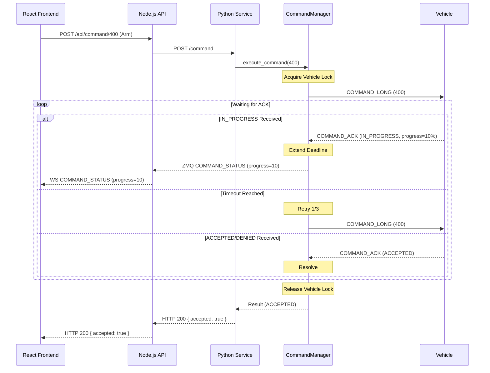

# Command Lifecycle Flow

This sequence diagram illustrates how commands are transmitted, tracked, and verified across the system.

```mermaid
sequenceDiagram
    participant UI as React Frontend
    participant Node as Node.js API
    participant Py as Python Service
    participant CmdMgr as CommandManager
    participant Drone as Vehicle

    UI->>Node: POST /api/command/400 (Arm)
    Node->>Py: POST /command
    Py->>CmdMgr: execute_command(400)
    
    Note over CmdMgr: Acquire Vehicle Lock
    CmdMgr->>Drone: COMMAND_LONG (400)
    
    loop Waiting for ACK
        alt IN_PROGRESS Received
            Drone-->>CmdMgr: COMMAND_ACK (IN_PROGRESS, progress=10%)
            Note over CmdMgr: Extend Deadline
            CmdMgr-->>Node: ZMQ COMMAND_STATUS (progress=10)
            Node-->>UI: WS COMMAND_STATUS (progress=10)
        else Timeout Reached
            Note over CmdMgr: Retry 1/3
            CmdMgr->>Drone: COMMAND_LONG (400)
        else ACCEPTED/DENIED Received
            Drone-->>CmdMgr: COMMAND_ACK (ACCEPTED)
            Note over CmdMgr: Resolve
        end
    end

    Note over CmdMgr: Release Vehicle Lock
    CmdMgr-->>Py: Result (ACCEPTED)
    Py-->>Node: HTTP 200 { accepted: true }
    Node-->>UI: HTTP 200 { accepted: true }
```
