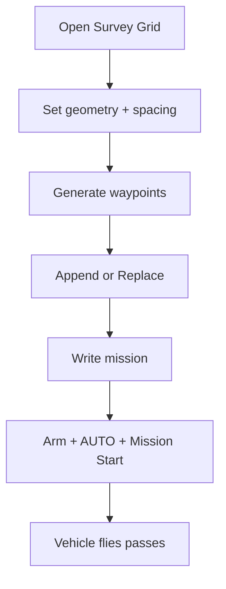
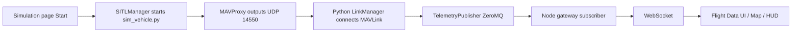
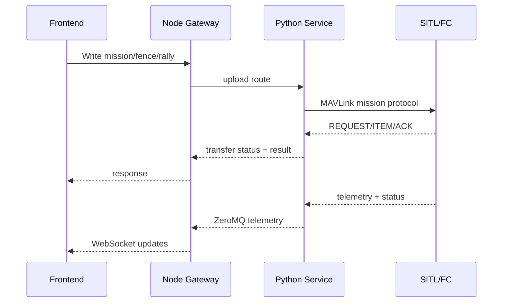

# Drone GCS Complete Feature Guide (User + Developer)

This document explains features in simple English and also shows implementation flow for developers.

For Flight Data basics and map context menu details, also see:
- `docs/operations/frontend_testing_workflow_guide.md`

---

## 6) Flight Planner Page: Mission vs Fence vs Rally

### What each means
- `MISSION`: normal navigation route (waypoints the vehicle follows in AUTO).
- `FENCE`: geofence boundaries (safety perimeter; inclusion/exclusion polygons).
- `RALLY`: emergency/safe points used by autopilot in rally-related behaviors.

### When to use
- `MISSION`: route planning and autonomous flight.
- `FENCE`: enforce where the drone is allowed/not allowed to fly.
- `RALLY`: define safe diversion/landing locations.

### How they differ
- Mission commands are usually `MAV_CMD_NAV_WAYPOINT (16)` and related nav commands.
- Fence points use fence polygon commands (`5001` inclusion / `5002` exclusion).
- Rally points use `MAV_CMD_NAV_RALLY_POINT (5100)`.

### Read / Write behavior
- `Read`: downloads current item set from flight controller (MISSION or FENCE or RALLY).
- `Write`: uploads current planner list to flight controller for the selected mission type.

### Data format used internally
- API JSON model (`MissionItem`): `seq, frame, command, current, autocontinue, param1..param4, lat, lng, alt`.
- Backend transfer routes:
  - `GET /mission`, `POST /mission/upload`
  - `GET /fence`, `POST /fence/upload`
  - `GET /rally`, `POST /rally/upload`

### File format notes
- Planner upload/download uses REST JSON payloads.
- `QGC WPL 110` waypoint file support exists in backend utility (`mission_file_io.py`) for import/export style workflows.

### Sample files for testing
- `docs/samples/mission_sample.json`
- `docs/samples/fence_sample.json`
- `docs/samples/rally_sample.json`

Use with API proxy (`http://localhost:8080/api/...`) if you want direct route tests.

---

## 7) Survey Grid

### What Survey Grid is
Survey Grid creates a lawnmower pattern (parallel passes) for mapping/survey missions.

### How it works
- Inputs: center lat/lng, width, length, heading, line spacing, along-track spacing, altitude.
- Generator creates stripes and points along each stripe.
- Alternates direction per stripe to minimize turn time.

### Waypoint spacing
- `Line spacing`: distance between adjacent passes.
- `Along spacing`: distance between points on one pass.
- Smaller spacing = denser coverage + more waypoints.

### Fix applied for huge region issue
- Added strict coordinate validation.
- Latitude is clamped to a safe range and longitude normalized.
- Guard added near poles to prevent division explosions.
- UI now shows validation error when grid cannot be generated.

### Execution flow

---

## 8) Mission Modes / Waypoint Issues

### Why mode can appear UNKNOWN
- Mode text comes from MAVLink HEARTBEAT decode.
- If mode mapping is unavailable/unsupported, fallback can show unknown.
- Improvement applied: decoder now first uses `pymavlink mode_string_v10` before fallback mapping.

### Mission editing enable state
- Editing waypoints is local planner state and should be editable when waypoints exist.
- Start Mission is gated by:
  - vehicle armed
  - mission loaded
  - mode is AUTO

### Upload + start mission flow
1. Build or read mission.
2. Click `Write`.
3. Arm vehicle.
4. Set mode `AUTO`.
5. Start mission.

### AUTO behavior
- FC executes uploaded mission items in sequence.
- UI monitors `MISSION_CURRENT` and highlights active waypoint.

---

## 9) Fence Features

### Fence types
- `Inclusion`: allowed area polygon.
- `Exclusion`: forbidden area polygon.

### Fence config fields
- `Enable/Disable`: toggles fence logic (`FENCE_ENABLE`).
- `Action`: what FC does on breach (`Report`, `RTL`, `Land`, `Brake` depending firmware support).
- `Radius`: horizontal fence radius limit.
- `Alt min/max`: vertical limits.

### Apply Fence Configuration
- Writes fence parameters through MAVLink param set/verify flow.
- If verify/rollback fails, backend returns failure details.

### Fixes and improvements
- Read/write error propagation improved so UI shows real backend transfer reason (instead of only generic “Failed to read mission”).
- Mission transfer status now includes transfer error details for fence/rally too.

---

## 10) Rally Points

### What rally points are
Predefined safe points used by FC in rally/emergency logic (depends on firmware behavior/settings).

### When used
- Autopilot can choose rally points during specific failsafe/RTL-related behaviors.

### Configure flow
1. Select `RALLY` in planner.
2. Add points on map/table.
3. Write rally set to FC.
4. Verify with Read.

### Fixes
- Improved error surfacing for rally read/write failures.
- Upload/read paths share transfer diagnostics with mission manager status.

---

## 11) Setup Page (Calibrations)

### Features
- Accelerometer calibration
- Compass calibration
- Level horizon
- ESC calibration
- Reboot autopilot

### MAVLink command flow
- Most calibrations use `MAV_CMD_PREFLIGHT_CALIBRATION (241)` with different parameter fields.
- Reboot uses `MAV_CMD_PREFLIGHT_REBOOT_SHUTDOWN (246)`.

### Why failures happen
- Vehicle not connected.
- Vehicle is armed/in-air.
- FC rejects command due to preconditions or mode/state.
- Sensor or firmware-specific restrictions.

### Fixes applied
- Calibration buttons are now blocked when armed (except reboot).
- UI shows clear preflight warning for calibration prerequisites.

---

## 12) Parameter System

### Fetch and sync
- `PARAM_REQUEST_LIST` triggers full parameter stream.
- Missing indices are re-requested with `PARAM_REQUEST_READ`.
- Progress is published in `PARAM_SYNC_STATUS`.

### Cache
- Saved in backend disk cache by `(sysid, compid)`.
- Can be loaded when reconnecting to speed startup.

### Display in Quick View
- Quick tab widgets are registry-driven (`TelemetryRegistry`) and now user-selectable.
- Widget selection is persisted in local storage.

### New/available UI capabilities
- Search, category filter, sort, paging.
- Import/export compare for JSON and `.param`.
- Favorites/pinned parameters added:
  - star/unstar rows
  - filter by `Favorites` category

---

## 13) Simulation Architecture (SITL)

### Components
- `sim_vehicle.py`: launches ArduPilot SITL vehicle.
- MAVProxy: bridges autopilot stream and forwards telemetry (`--out udp:127.0.0.1:14550`).
- Python backend: MAVLink command/control and mission/param services.
- Node gateway: HTTP proxy + WS broadcast.
- Frontend: operation pages and planning tools.

### Transport flow
- MAVLink transport: UDP/TCP serial endpoint in backend LinkManager.
- Internal telemetry: ZeroMQ PUB/SUB.
- Browser feed: WebSocket from Node server.

### Lifecycle
- Start -> process launched -> optional auto-connect -> telemetry active.
- Stop -> process terminated -> backend disconnects cleanly.
- Reset -> stop then start with same config.

---

## 14) Final Combined Testing Guide

## User flow checklist
1. Start Simulation.
2. Verify connection state becomes `CONNECTED/ACTIVE`.
3. Confirm map + telemetry live updates.
4. Plan mission/fence/rally.
5. Write and Read back each type.
6. Arm + mode set + mission start.
7. Observe mission progression and waypoint highlight.
8. Trigger safety commands (RTL/LAND) and verify response.

## Developer verification checklist
- API endpoints reachable in Node + Python.
- Mission manager transfer status shows `phase/current/total/ok/error`.
- COMMAND_ACK and MISSION_ACK are surfaced to UI.
- PARAM sync state increments and cache load works.
- WS stream remains stable under command bursts.

---

## Important implementation notes
- Mission read decode now correctly handles `MISSION_ITEM_INT` vs `MISSION_ITEM`.
- Survey generator now prevents invalid coordinate expansion.
- Planner read/write errors now include transfer diagnostics.
- Mode decode robustness improved for unknown mode strings.
- Actions/Setup/Messages/Quick enhancements from recent fixes remain active.

