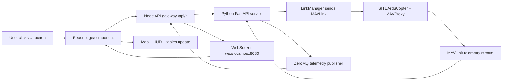
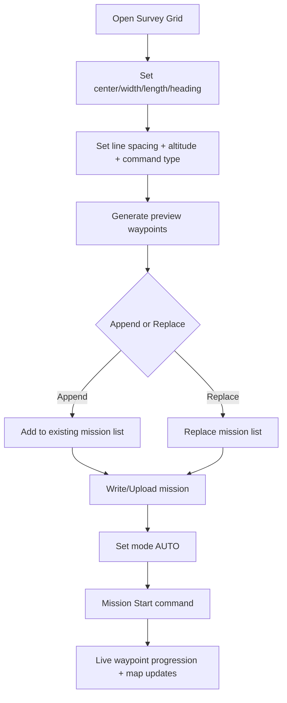
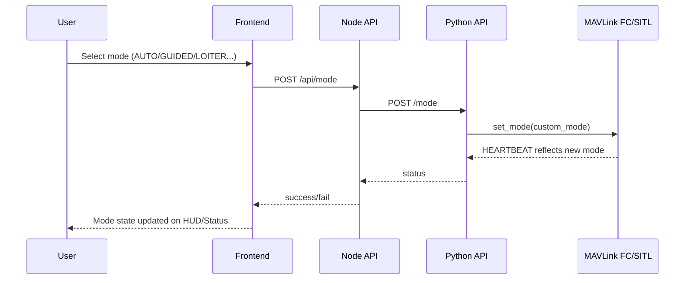

# Frontend Feature and Workflow Test Guide

This guide explains the frontend in simple English so you can test each feature end-to-end like Mission Planner.

---

## 1) End-to-End Data Flow (UI to MAVLink and back)

Expected behavior:
- Commands go from UI to MAVLink and return ACK/result.
- Telemetry returns continuously and updates HUD, map, and tabs.
- No repeated disconnect/reconnect loops during normal operation.

---

## 2) Flight Data Page

### Purpose
`Flight Data` is the live operations page. It shows connection state, vehicle telemetry, map movement, and command controls.

### Main items to test
- Connection ribbon (`CONNECTED`/`ACTIVE`, HB age, GPS, battery, mode).
- HUD (horizon, heading, arm state, mode).
- Telemetry tabs (Quick, Actions, Messages, PreFlight, Gauges, Status, Servo).
- Live map tracking.

---

## 3) Map Buttons: `My location` and `Go to vehicle`

### `My location`
- **What it does:** Centers map on your browser/device location.
- **How to use:** Click `My location` on map overlay.
- **Expected output:** Map jumps to your current location and stores map preference.
- **When to use:** Recenter to operator position during field tests.

Internal flow:
- Browser geolocation API -> map center update -> saved in local map preferences.

### `Go to vehicle`
- **What it does:** Centers map on current primary vehicle position.
- **How to use:** Click `Go to vehicle` (enabled once valid lat/lng exists).
- **Expected output:** Map recenters and zooms near vehicle.
- **When to use:** Quickly recover visual tracking after panning away.

---

## 4) Right-Click Map Menu (Each Option)

> Right-click map opens context menu. Some items are mission-type aware (`MISSION`, `FENCE`, `RALLY`).

### `Add waypoint (planner)`
- Adds a mission waypoint at clicked location.
- Stored in mission planner store (frontend list), not uploaded yet.
- Use when building mission path quickly.

### `Insert waypoint`
- Inserts waypoint after currently selected sequence.
- Useful for editing an existing route.

### `Set guided target (fly to)`
- Sends guided position command (`/api/flyto`) to backend.
- Vehicle responds only when mode/state allows guided navigation.
- Expected result: status banner `Guided target: OK` and vehicle moves to target.

### `Set home here`
- Sends `MAV_CMD_DO_SET_HOME` via `/api/vehicle/set_home`.
- Updates home point used for RTL and home-distance calculations.

### `RTL (command)`
- Sends `MAV_CMD_NAV_RETURN_TO_LAUNCH`.
- Vehicle behavior: return to home and land/loiter based on autopilot config.

### `Add fence point`
- Switches planner mission type to `FENCE` and adds polygon vertex.
- Upload required afterward to enforce on FC.

### `Add rally point`
- Switches planner mission type to `RALLY` and adds safe rally point.
- Upload required for autopilot use.

### `Set ROI here`
- Sends `MAV_CMD_DO_SET_ROI_LOCATION` for camera/point-of-interest orientation.

### `Clear ROI`
- Sends `MAV_CMD_DO_SET_ROI_NONE`.

### `Survey grid…`
- Opens Planner with survey modal seeded from clicked location.
- Generates lawnmower mission pattern.

### `Delete selected waypoint`
- Deletes currently selected waypoint from planner list.

### `Select features`
- Not a dedicated context action yet.
- Current selection is waypoint-sequence selection from planner table and active mission-type context.

---

## 5) Survey Grid Workflow (Mission Planning)

Step-by-step:
1. Open `Flight Planner` -> `Survey grid`.
2. Configure geometry and spacing.
3. Click `Append grid` or `Replace mission`.
4. Verify waypoints in table/map.
5. Click mission `Write/Upload`.
6. In Flight Data: arm -> set `AUTO` -> `Start Mission`.
7. Monitor `current waypoint`, track line, and command status.

Expected outputs:
- Mission upload ACK success.
- Current waypoint highlights in UI.
- Vehicle follows grid legs in AUTO.

---

## 6) Compass and HUD (Mission Planner style behavior)

Implemented/fixed:
- Heading now uses `velocity.heading` with fallback to yaw-derived heading.
- Backend heading decode now reads MAVLink `GLOBAL_POSITION_INT.hdg` correctly.
- HUD arm indicator now updates reliably with explicit armed/disarmed visual dot.

How it works:
- MAVLink `HEARTBEAT` updates arm/mode.
- MAVLink `VFR_HUD` and `GLOBAL_POSITION_INT` update heading.
- WebSocket telemetry updates HUD live.

Expected behavior:
- Heading ribbon should move continuously during yaw/turn.
- `ARMED`/`DISARMED` text and status dot should match vehicle state.
- Mode label should follow autopilot mode changes.

---

## 7) Quick Panel Parameters and Dynamic Widgets

### Current architecture
- MAVLink `PARAM_VALUE` messages are parsed in Python and cached in vehicle state / parameter manager.
- Telemetry widgets are defined in `TelemetryRegistry`.
- `Quick` tab renders selected keys from this registry.

### New behavior for testing
- `Quick` tab now has `Customize widgets`.
- Users can select which widgets appear and order is preserved.
- Selection is stored in browser local storage.

### How to add more widgets
1. Add a new entry in `TelemetryRegistry` with:
   - `label`
   - `getValue(state)`
   - `color`
2. Open Quick tab customization and enable it.

Expected output:
- Newly added metric appears in Quick tab and updates with telemetry.

---

## 8) Actions Panel and Mode Switching

## Fixed issue
- `404` errors on actions were caused by wrong endpoint usage.
- Actions tab now sends numeric MAVLink commands to `/api/mavlink/command` (valid route).

### Action semantics
- `ARM`: enable motors (must pass safety checks/GPS/arming checks).
- `DISARM`: stop motors (usually denied if airborne).
- `TAKEOFF`: initiate auto takeoff to target altitude.
- `LAND`: descend and land at current location.
- `RTL`: return to home.
- `LOITER`: hold position.
- `AUTO`: follow uploaded mission.
- `GUIDED`: accept guided setpoint commands.
- `STABILIZE`: manual attitude-stabilized mode.

### `Set Mode` internal flow

Expected behavior:
- Successful mode change appears in ribbon/HUD quickly.
- If mode denied, command status shows error/rejection reason.

---

## 9) Messages Panel (UI/UX)

Implemented/fixed:
- Auto-scroll now only happens when user is already near the bottom.
- Prevents forced scroll-jumping while reading older messages.
- Improved row key stability and responsive row alignment.
- Tab strip is horizontally scrollable for narrow widths.

How to use:
- Open `Messages` tab.
- Let new STATUSTEXT messages arrive.
- Scroll upward and verify view does not snap back unexpectedly.

Expected behavior:
- Smooth real-time logging at bottom when monitoring live.
- Stable manual scroll while reviewing old messages.

---

## 10) Full MVP Operational Test Script

1. Start SITL from `Simulation` page.
2. Verify connection becomes `CONNECTED/ACTIVE`.
3. Confirm live telemetry values update in `Flight Data`.
4. Use `Go to vehicle` and confirm map centers on drone.
5. Build mission/survey in `Flight Planner`.
6. Upload mission and verify success banner/ACK.
7. In `Actions`:
   - `ARM`
   - set `AUTO`
   - `MISSION_START` (or Start Mission control)
8. Verify:
   - waypoint progression increments
   - map marker moves along path
   - messages/status show mission execution
9. Trigger `RTL` and verify return behavior.

Pass criteria:
- No 404 action errors.
- No stuck HUD heading.
- No stale arm status.
- Stable telemetry stream and message panel usability.

