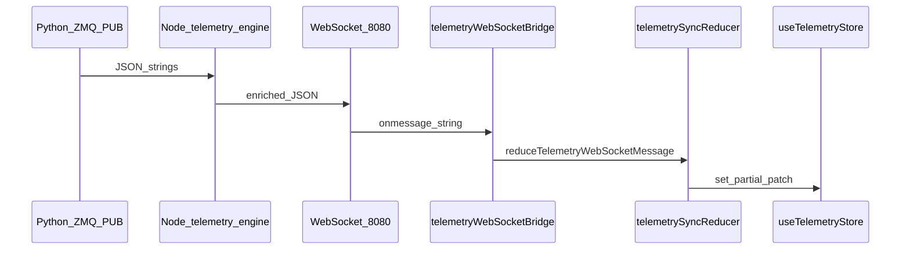

# Frontend telemetry state flow (summary)

## End-to-end path

1. **Python** publishes telemetry JSON (10 Hz) → **Node** may attach `telemetry_engine` + `engine_envelope`.
2. **Browser** `WebSocket` receives a string.
3. **`applyInboundTelemetryPayload(get, set, jsonString)`** parses JSON once.
4. **`reduceTelemetryWebSocketMessage(prev, payload)`** computes the next `telemetry`, `connectionState`, `operational`, `sync`, etc., from the **previous snapshot** (`snapshotFromGet`).
5. **Zustand** `set` merges the patch immutably.

## Store slices

| Slice | Role |
|-------|------|
| `telemetry` | Raw per-vehicle payload (`data` from `TELEMETRY_UPDATE`), including optional `telemetry_engine` / `schema_version`. |
| `sync` | Client transport: last inbound time, seq counter, reconnect attempts, last `engine_envelope`. |
| `connectionState` / `connected` / `primarySysId` / `vehiclesRoster` | Same semantics as before; updated inside reducer for WS messages. |
| `operational` / `operationalHistory` | Still from **`deriveOperationalPhase`** + primary vehicle raw snapshot. |

## Derived vs raw

- **Raw:** `telemetry[vehicleId]` — used by existing HUD/map (`vehicle.attitude`, etc.).
- **Derived:** computed by **selectors** reading `telemetry_engine` (Node) or falling back to rad→deg math — does not duplicate storage.

## Message types handled in reducer

- `TELEMETRY_UPDATE`
- `CONNECTION_STATUS`
- `ADSB_UPDATE`
- `PARAM_SYNC_STATUS`

Other JSON objects are ignored by the reducer (no patch); future types can extend the reducer.

## Reconnect / disconnect

- **`ws.onclose`:** clears `connected`, drops WS handle, clears ADS-B + roster, resets operational phase, increments `sync.reconnectAttempts`, sets `sync.wsTransport` to `CLOSED`, then reconnects after 2s (unchanged behavior).
- **`CONNECTION_STATUS` DISCONNECTED:** reducer clears `telemetry` and primary id (same as prior inline logic).

---

*See also [`MIGRATION.md`](MIGRATION.md) and architecture docs at repo root.*
