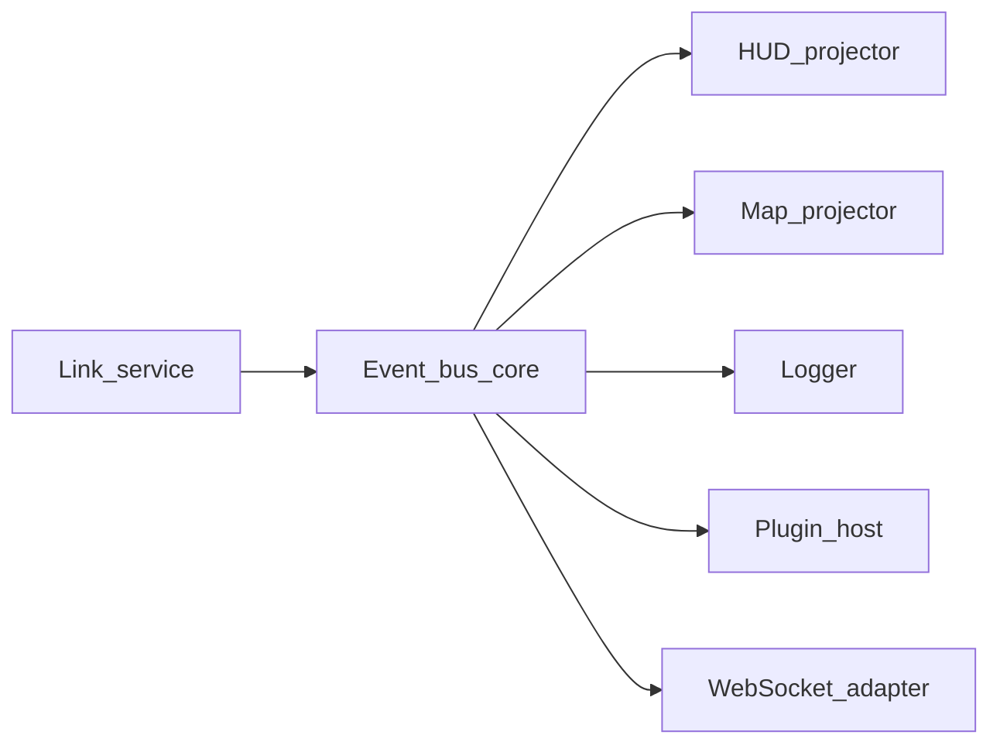

# Event bus design (target)

Mission Planner uses **layered dispatch**: `readPacketAsync` → `processInfoFromStream` → `PacketReceived` subscriptions → `OnPacketReceived` → `CurrentState` ([`mavlink-ingestion.md`](mavlink-ingestion.md), [`telemetry-state-flow.md`](telemetry-state-flow.md)). Drone-System-Collab today uses **implicit** “bus” behavior: ZMQ JSON strings and WS broadcast with string `type` fields — **no central contract**.

This document defines a **target event-bus model** (conceptual). **No code, no new folders.**

---

## 1. Goals

- **Decouple** MAVLink decode from UI, map, HUD, logging, and plugins.
- **Version** messages for backward-compatible frontend evolution.
- **Support** multi-drone, param sync, connection lifecycle, and ADS-B as first-class topics.
- Allow **replay** (log playback) and **simulation** to feed the same bus.

---

## 2. Bus topology (target)



**Physical deployment (flexible):** bus can run **in-process** inside Node telemetry process (simplest), or as a **library** invoked from Python with ZMQ egress — migration starts in-process in Node to match existing WS hub.

---

## 3. Envelope schema (normative for target, not implemented here)

Every bus message:

```json
{
  "v": 1,
  "ts": "2026-05-14T12:34:56.789Z",
  "monotonic_ms": 123456789,
  "source": "link:primary",
  "kind": "TELEMETRY_PATCH | DOMAIN_EVENT | CONNECTION | PARAM | MISSION | ADSB | ERROR",
  "target": { "sysid": 1, "compid": 1 },
  "name": "ATTITUDE",
  "idempotency_key": "optional-hash-or-seq"
}
```

Payload either:

- **`patch`**: RFC 7396 JSON Merge Patch against `vehicle.snapshot`, or
- **`data`**: opaque event body for `DOMAIN_EVENT`.

---

## 4. Topic taxonomy (logical names)

| Topic prefix | Examples |
|--------------|----------|
| `connection.*` | `connection.state`, `connection.ports` |
| `vehicle.<sysid>.telemetry.*` | `...attitude`, `...position`, `...battery` |
| `vehicle.<sysid>.param.*` | `...sync_progress`, `...value` |
| `vehicle.<sysid>.mission.*` | `...upload_result`, `...current_seq` |
| `adsb.*` | `adsb.tracks` |
| `command.*` | `command.result` (arm, mode, takeoff) |

Today’s string types map cleanly: `TELEMETRY_UPDATE` → `vehicle.{id}.telemetry.snapshot` (interim) then patches.

---

## 5. Ordering and loss

- **Per link:** total order of processed messages (single reader thread / asyncio task).
- **Per vehicle:** partition by `(sysid, compid)`; consumers may reorder only within same partition rules.
- **At-least-once vs at-most-once:** WS to browser is **at-most-once**; clients must tolerate gaps — include **`seq`** per partition for gap detection.

---

## 6. Backpressure

- If WS client slow: **drop** coalesced attitude, never drop `CONNECTION_STATUS` or `ARMING`/`FAILSAFE` class events — priority queue conceptually.
- Mission Planner accepts brief inconsistency; web should **surface** backlog via `link_quality` or `consumer_lag_ms` in envelope (future metric).

---

## 7. Plugin architecture (target)

- **Plugin host** subscribes to `DOMAIN_EVENT` + selected telemetry topics.
- Plugins **cannot** block ingest thread — run on worker pool with timeout.
- **API:** register `(filter, handler)` similar to MP `SubscribeToPacketType` ([`mavlink-ingestion.md`](mavlink-ingestion.md) §6) but at **decoded** layer, not raw bytes.

---

## 8. Relation to existing Zustand store

[`useTelemetryStore`](drone_gcs/frontend/src/store/useTelemetryStore.js) becomes a **single subscriber** that:

1. Applies patches to normalized store slices, or
2. Dispatches to small domain stores (HUD, map, params) via lightweight internal pub/sub.

---

## 9. Security (target)

- WSS + token for LAN GCS when Electron ships; separate **read-only** vs **command** roles for multi-operator.

---

*Design-only document.*
