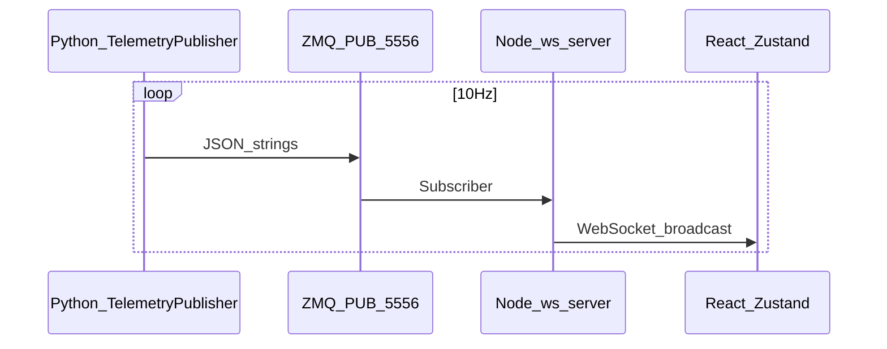
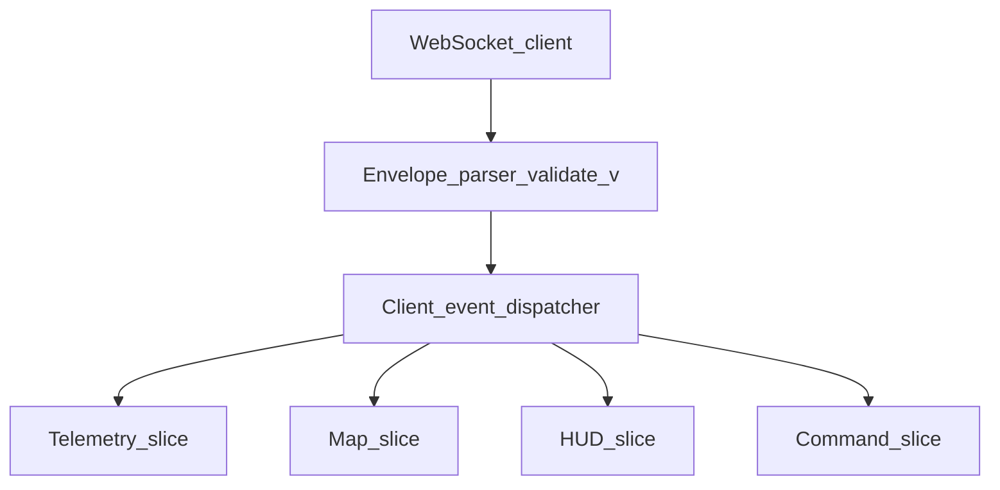

# Frontend sync architecture (target)

Describes how **React** clients should synchronize with backend telemetry under a Mission Planner–informed model: **push snapshots + eventual deltas**, **explicit connection lifecycle**, and **HUD/map consistency**. Current implementation reference: [`drone_gcs/frontend/src/store/useTelemetryStore.js`](drone_gcs/frontend/src/store/useTelemetryStore.js), [`FlightData.jsx`](drone_gcs/frontend/src/pages/FlightData.jsx), [`AdvancedHUD.jsx`](drone_gcs/frontend/src/components/AdvancedHUD.jsx). **Design only — no code.**

---

## 1. Current flow (as-is)

- `useTelemetryStore.connect()` opens **ws://localhost:8080**, parses `TELEMETRY_UPDATE`, `CONNECTION_STATUS`, `ADSB_UPDATE`, `PARAM_SYNC_STATUS`.
- **Reconnect:** `onclose` → `setTimeout(..., 2000)` → `connect()` — clears roster/telemetry on some paths.
- **Operational phase:** `deriveOperationalPhase` combines connection + vehicle snapshot.

---

## 2. Gaps vs Mission Planner UI sync

| MP pattern | Current frontend |
|------------|------------------|
| `BindingSource.UpdateDataSource` on UI thread | Zustand updates on WS message thread (main thread) — OK for browser |
| ~10 Hz binding + per-control Invalidate | Full snapshot merge at 10 Hz — **over-merge** risk for high-rate future data |
| `UpdateCurrentSettings` derived fields server-side | Partially duplicated in `operationalState.js` client-side |
| Multi-tab / dropout HUD | Single page React — no detached HUD window pattern |

---

## 3. Target client architecture

- **Single ingress** (`EP`) validates `schema_version`; rejects or upgrades old payloads.
- **BUS** maps `kind` → reducers (Zustand middleware or small **mitt**/**Emitter**).
- **HUD_slice** subscribes only to attitude + status + messages — reduces rerenders vs one giant store update.

---

## 4. Electron (optional packaging)

- **Shell:** BrowserWindow loading same Vite build or hosted URL.
- **Capabilities:** serial path hints, auto-start Python/Node supervised child processes, file picks for logs.
- **Telemetry path unchanged** — Electron is not a second sync mechanism; still WS to local gateway.

---

## 5. Reconnect strategy (target)

| Phase | Behavior |
|-------|----------|
| WS lost | Show `RECONNECTING`; exponential backoff (cap 30s); **do not** silently clear last vehicle state for N seconds (pilot may still need last alt). |
| Link lost | Backend emits `CONNECTION_STATUS` → client sets `HEARTBEAT_LOST` styling; optional grey-out HUD. |
| Resync | After `CONNECTED`, REST pull `/api/state` once to **reconcile** if WS missed frames. |

---

## 6. Stale telemetry UX

- If `attitude.meta.stale` (future schema): HUD draws **diagonal stripe overlay** or banner (per [`vehicle-state-schema.md`](vehicle-state-schema.md)).
- Map: fade trail when position stale.

---

## 7. Command system sync

Today: `sendShortcutCommand` + `commandStatus` in store — good pattern.

Target:

- Correlate commands with **`command_id`** in WS `COMMAND_ACK` events (bus) — same idea as MP pending command tracking on link.

---

## 8. Map synchronization

- **Source of truth:** telemetry position + optional mission store (`useMissionStore`) for planned path.
- **Target:** map listens to **`vehicle.position`** patches + **`mission.updated`** events rather than polling REST except on page load / explicit refresh.

---

## 9. HUD synchronization

- **AdvancedHUD** should consume **HUD_slice** (degrees, fixed aspect) — align with MP horizon math ([`hud-architecture.md`](hud-architecture.md)) once backend reports degrees consistently.
- **Throttle paint:** `requestAnimationFrame` coalesce if multiple WS messages per frame.

---

## 10. Testing hooks (target)

- Inject **mock bus** in dev with recorded envelopes — parity with MP log playback mindset.

---

*Design-only document.*
