# Mission Planner — MAVLink ingestion

How **`MAVLinkInterface.readPacketAsync`** turns bytes into **`MAVLinkMessage`** instances, updates **per-vehicle caches**, runs **subscriptions**, and raises **`OnPacketReceived`**. Complements [`telemetry-state-flow.md`](telemetry-state-flow.md).

## 1. Ingestion pipeline diagram

```mermaid
flowchart TB
  subgraph read [readPacketAsync]
    RL[readlock_WaitAsync]
    Bytes[read_from_BaseStream_or_log]
    Assemble[frame_length_CRC_signature]
    Log[SaveToTlog_optional_flush]
    PIFS[processInfoFromStream]
    Seq[sequence_loss_stats]
    AP[addPacket]
    PR[PacketReceived_subscriptions]
    EVT[OnPacketReceived_invoke]
    LV[lastvalidpacket_update]
  end

  Bytes --> Assemble
  RL --> Bytes
  Assemble --> Log
  Log --> PIFS
  PIFS --> Seq
  Seq --> AP
  AP --> PR
  PR --> EVT
  EVT --> LV
```

## 2. Entry points

- **Live link:** `BaseStream` (serial / TCP / UDP implementations) read inside **`readPacketAsync`** with configurable timeouts (e.g. 1200 ms inter-character for GPS detection compatibility).
- **Log playback:** `logreadmode` uses log-specific readers (`readlogPacketMavlink`, timestamps) instead of live `BaseStream`.

**Orchestration:** [`MainV2.SerialReader`](MissionPlanner/MainV2.cs) (and similar) loops calling **`await port.readPacketAsync()`** while data is available, then refreshes all **`MAV.cs.UpdateCurrentSettings`**.

## 3. `readPacketAsync` lifecycle (conceptual)

1. **`await readlock.WaitAsync()`** — single-reader serialization; released in `finally` after sequence handling to avoid reorder bugs.
2. **Read bytes** until a full MAVLink v1/v2 frame is available; validate length, CRC, optional **signing** block.
3. **Optional logging:** `SaveToTlog`, flush policies on `msgid == 0`, etc.
4. **`processInfoFromStream(ref message, sysid, compid)`** — see §5 (runs **before** broadcast to subscribers in the current code structure for valid buffers).
5. **GCS packet short-circuit** in log mode: may return early without further processing for GCS-origin sysids.
6. **Packet loss / rate stats** when header valid and length sufficient: compare `packetSeqNo` to expected, update **`packetslost` / `packetsnotlost`**, **`recvpacketcount`**, **`packetspersecond`** EMA per `msgid`; emit **`WhenPacketLost`** / **`WhenPacketReceived`** reactive signals.
7. **`readlock.Release()`** in `finally`.
8. **`addPacket(message)`** on `MAVlist[sysid, compid]` if sequence considered valid.
9. **Special messages:** ADSB, COLLISION, UAVCAN node info, **HEARTBEAT** / **HIGH_LATENCY2** discovery, etc.
10. **`PacketReceived(message)`** — subscription callbacks.
11. **`_OnPacketReceived?.Invoke(this, message)`** — includes **`CurrentState.Parent_OnPacketReceived`** subscribers.
12. **`STATUSTEXT`** handling: append to `cs.messages`, cap list, optional speech, **`messageHigh`** for severity / tuning / PreArm / Arm prefixes.
13. **Optional auto param commit:** `PREFLIGHT_STORAGE` after idle since `lastparamset` when setting enabled.
14. **`MAVlist[sysid, compid].lastvalidpacket = UtcNow`**.
15. **`ProcessMirrorStream`** for mirror ports.

## 4. Per-message cache (`MAVState.addPacket`)

From [`MAVState.cs`](MissionPlanner/ExtLibs/ArduPilot/Mavlink/MAVState.cs):

- **`packets[msgid]`**: `Queue<MAVLinkMessage>` — enqueue latest; **trim to max 5** if consumers do not dequeue (bounded memory).
- **`packetsLast[msgid]`**: last message of each id for “peek latest” APIs.
- **`packetslock`** wraps queue operations.

**Consumers:** code that needs the **raw last packet** of a type (e.g. protocol helpers, tests, plugins) uses **`getPacket` / `getPacketLast`**.

## 5. `processInfoFromStream` (stream-derived protocol state)

**Location:** private method on **`MAVLinkInterface`**.

**Examples of responsibilities** (non-exhaustive):

- **Mission protocol:** `MISSION_COUNT` clears `wps` / `fencepoints` / `rallypoints` by mission type; `MISSION_ITEM` / `MISSION_ITEM_INT` populate sequences or `GuidedMode` when `current == 2`.
- **Home:** `HOME_POSITION` sets **`MAVlist[sysid, compid].cs.HomeLocation`**.
- **Guided:** `SET_POSITION_TARGET_GLOBAL_INT` → `GuidedMode`.
- **Fence / rally legacy messages:** `FENCE_POINT`, `RALLY_POINT`.
- **Camera:** `CAMERA_FEEDBACK` deduped append to `camerapoints`.
- **Parameters:** `PARAM_VALUE` merges into **`MAVlist[..].param`** and **`param_types`** (with GCS target rewriting in log playback scenarios).

**Important:** This runs on the **same thread as `readPacketAsync`** for that packet — side effects can **send replies** (e.g. TIMESYNC) as noted in XML doc on the method.

## 6. Subscription system (`PacketReceived`)

- **`SubscribeToPacketType(msgid, func, sysid, compid, exclusive)`** registers a handler in a **list** protected by **`Subscriptions`** lock.
- **`PacketReceived(message)`** copies the list and invokes matching entries (exact `(sysid,compid)` or `(0,0)` meaning “current vehicle”).
- Used for **targeted** handling without subscribing the entire `CurrentState` switch.

## 7. Demultiplexing (`MAVlist`)

- Packets carry **`sysid` / `compid`**.
- Unknown vehicles get **`MAVlist.Create`** on first qualifying **HEARTBEAT** / **HIGH_LATENCY2** / CAN status (see `readPacketAsync`).
- **`MAVlist[sysid, compid]`** selects **`MAVState`** for caches and **`cs`** for telemetry.

## 8. Parameter synchronization (ingestion side)

- **`PARAM_VALUE`** in **`processInfoFromStream`** updates **`MAVLinkParamList`** and type map.
- **Bulk pull:** `getParamList` / `getParamListAsync` / MAVFTP variants issue requests and consume **`PARAM_VALUE`** stream.
- **Disk cache:** `MAVState` debounced **JSON** write to **`paramcache/.../param.json`** on `param` `PropertyChanged`.

## 9. Packet loss and link health inputs

- **Sequence gap:** increments **`packetslost`** by computed gap; **`packetsnotlost++`** on each valid in-order progression.
- **Decay:** every ~5 s, **`packetslost` / `packetsnotlost`** multiplied by **0.8** (exponential smoothing).
- **`synclost`:** counts wrap/sequence anomalies for diagnostics.

## 10. Threading model

- **`readPacketAsync`** is **async**; continuations may run on thread-pool threads depending on host — **do not assume UI thread**.
- **Any work in `OnPacketReceived` / `CurrentState` switch** must be **thread-safe with UI** if it touches controls (Mission Planner generally avoids direct UI work there and uses `BeginInvoke` + bindings).

## 11. Reusable backend vs interface-only concerns

| Reusable | Interface / host |
|----------|------------------|
| Frame validation pattern, `MAVState` queue cache, `processInfoFromStream` rules | `BaseStream`, mirror, raw log file handles, `MainV2` reader loop |

---

*Architecture reference only; does not modify Mission Planner code.*
