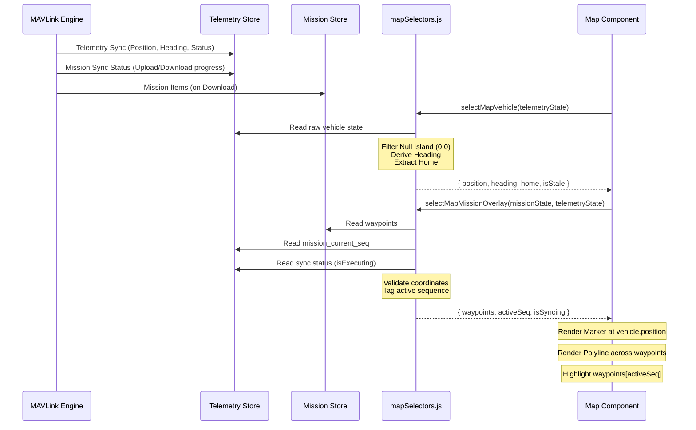

# Mission Map Integration Flow

This diagram illustrates how raw MAVLink data flows into the Zustand stores and gets normalized by the map selectors before rendering.

```mermaid
sequenceDiagram
    participant MAV as MAVLink Engine
    participant TS as Telemetry Store
    participant MS as Mission Store
    participant Sel as mapSelectors.js
    participant UI as Map Component

    MAV->>TS: Telemetry Sync (Position, Heading, Status)
    MAV->>TS: Mission Sync Status (Upload/Download progress)
    MAV->>MS: Mission Items (on Download)
    
    UI->>Sel: selectMapVehicle(telemetryState)
    Sel->>TS: Read raw vehicle state
    Note over Sel: Filter Null Island (0,0)<br/>Derive Heading<br/>Extract Home
    Sel-->>UI: { position, heading, home, isStale }
    
    UI->>Sel: selectMapMissionOverlay(missionState, telemetryState)
    Sel->>MS: Read waypoints
    Sel->>TS: Read mission_current_seq
    Sel->>TS: Read sync status (isExecuting)
    Note over Sel: Validate coordinates<br/>Tag active sequence
    Sel-->>UI: { waypoints, activeSeq, isSyncing }
    
    Note over UI: Render Marker at vehicle.position
    Note over UI: Render Polyline across waypoints
    Note over UI: Highlight waypoints[activeSeq]
```
