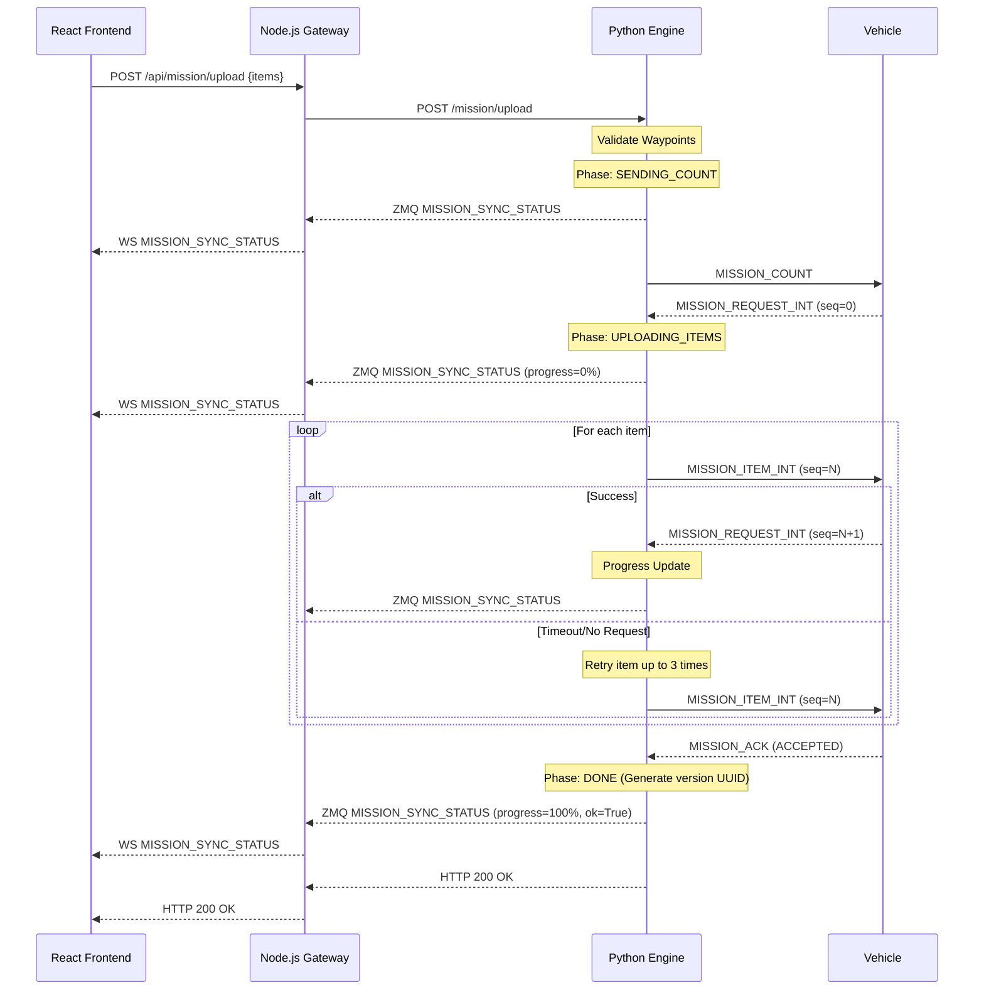

# Mission Synchronization Flow

This diagram illustrates the upload state machine, highlighting the interaction between the Python mission manager, the drone, and the streaming frontend updates.

```mermaid
sequenceDiagram
    participant UI as React Frontend
    participant Node as Node.js Gateway
    participant Py as Python Engine
    participant Drone as Vehicle

    UI->>Node: POST /api/mission/upload {items}
    Node->>Py: POST /mission/upload
    
    Note over Py: Validate Waypoints
    Note over Py: Phase: SENDING_COUNT
    Py-->>Node: ZMQ MISSION_SYNC_STATUS
    Node-->>UI: WS MISSION_SYNC_STATUS
    
    Py->>Drone: MISSION_COUNT
    Drone-->>Py: MISSION_REQUEST_INT (seq=0)
    
    Note over Py: Phase: UPLOADING_ITEMS
    Py-->>Node: ZMQ MISSION_SYNC_STATUS (progress=0%)
    Node-->>UI: WS MISSION_SYNC_STATUS
    
    loop For each item
        Py->>Drone: MISSION_ITEM_INT (seq=N)
        alt Success
            Drone-->>Py: MISSION_REQUEST_INT (seq=N+1)
            Note over Py: Progress Update
            Py-->>Node: ZMQ MISSION_SYNC_STATUS
        else Timeout/No Request
            Note over Py: Retry item up to 3 times
            Py->>Drone: MISSION_ITEM_INT (seq=N)
        end
    end
    
    Drone-->>Py: MISSION_ACK (ACCEPTED)
    Note over Py: Phase: DONE (Generate version UUID)
    
    Py-->>Node: ZMQ MISSION_SYNC_STATUS (progress=100%, ok=True)
    Node-->>UI: WS MISSION_SYNC_STATUS
    Py-->>Node: HTTP 200 OK
    Node-->>UI: HTTP 200 OK
```
