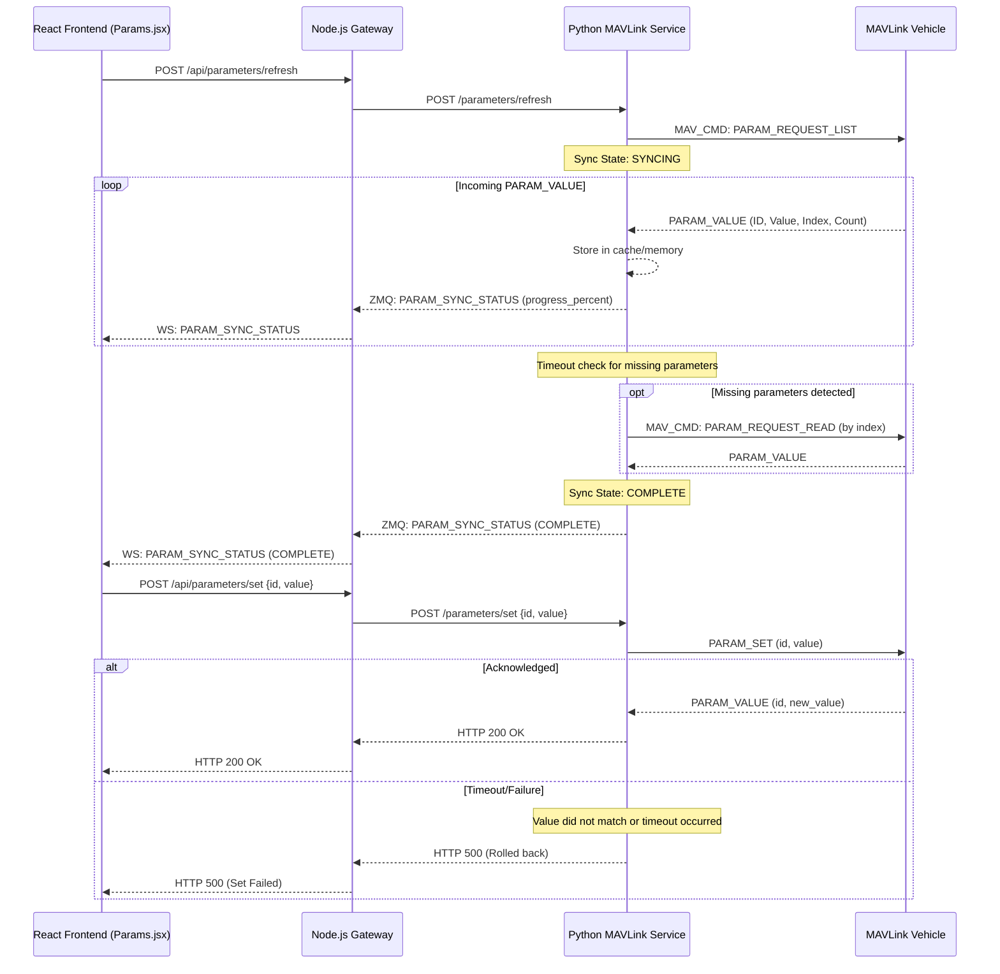

# Parameter Synchronization Flow

This flowchart describes the lifecycle of parameter fetching and updating in the Drone-System-Collab ecosystem.

```mermaid
sequenceDiagram
    participant UI as React Frontend (Params.jsx)
    participant Node as Node.js Gateway
    participant Python as Python MAVLink Service
    participant Drone as MAVLink Vehicle

    %% Fetch All Flow
    UI->>Node: POST /api/parameters/refresh
    Node->>Python: POST /parameters/refresh
    Python->>Drone: MAV_CMD: PARAM_REQUEST_LIST
    Note over Python: Sync State: SYNCING
    
    loop Incoming PARAM_VALUE
        Drone-->>Python: PARAM_VALUE (ID, Value, Index, Count)
        Python-->>Python: Store in cache/memory
        Python-->>Node: ZMQ: PARAM_SYNC_STATUS (progress_percent)
        Node-->>UI: WS: PARAM_SYNC_STATUS
    end

    %% Missing Parameters Recovery
    Note over Python: Timeout check for missing parameters
    opt Missing parameters detected
        Python->>Drone: MAV_CMD: PARAM_REQUEST_READ (by index)
        Drone-->>Python: PARAM_VALUE
    end

    Note over Python: Sync State: COMPLETE
    Python-->>Node: ZMQ: PARAM_SYNC_STATUS (COMPLETE)
    Node-->>UI: WS: PARAM_SYNC_STATUS (COMPLETE)

    %% Set Parameter Flow
    UI->>Node: POST /api/parameters/set {id, value}
    Node->>Python: POST /parameters/set {id, value}
    Python->>Drone: PARAM_SET (id, value)
    
    alt Acknowledged
        Drone-->>Python: PARAM_VALUE (id, new_value)
        Python-->>Node: HTTP 200 OK
        Node-->>UI: HTTP 200 OK
    else Timeout/Failure
        Note over Python: Value did not match or timeout occurred
        Python-->>Node: HTTP 500 (Rolled back)
        Node-->>UI: HTTP 500 (Set Failed)
    end
```
