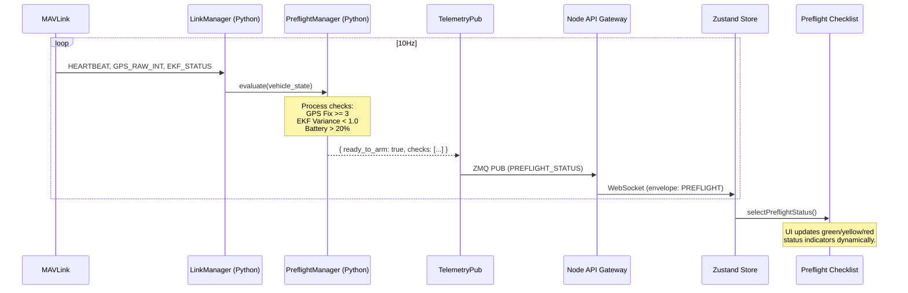

# Preflight Validation Flow

This sequence diagram illustrates how raw vehicle parameters continuously flow through the PreflightManager and synchronize directly to the React interface.

```mermaid
sequenceDiagram
    participant MAV as MAVLink
    participant LM as LinkManager (Python)
    participant PF as PreflightManager (Python)
    participant ZMQ as TelemetryPub
    participant NODE as Node API Gateway
    participant REACT as Zustand Store
    participant UI as Preflight Checklist

    loop 10Hz
        MAV->>LM: HEARTBEAT, GPS_RAW_INT, EKF_STATUS
        LM->>PF: evaluate(vehicle_state)
        Note over PF: Process checks:<br>GPS Fix >= 3<br>EKF Variance < 1.0<br>Battery > 20%
        PF-->>ZMQ: { ready_to_arm: true, checks: [...] }
        ZMQ->>NODE: ZMQ PUB (PREFLIGHT_STATUS)
        NODE->>REACT: WebSocket (envelope: PREFLIGHT)
    end
    
    REACT->>UI: selectPreflightStatus()
    Note over UI: UI updates green/yellow/red<br>status indicators dynamically.
```
