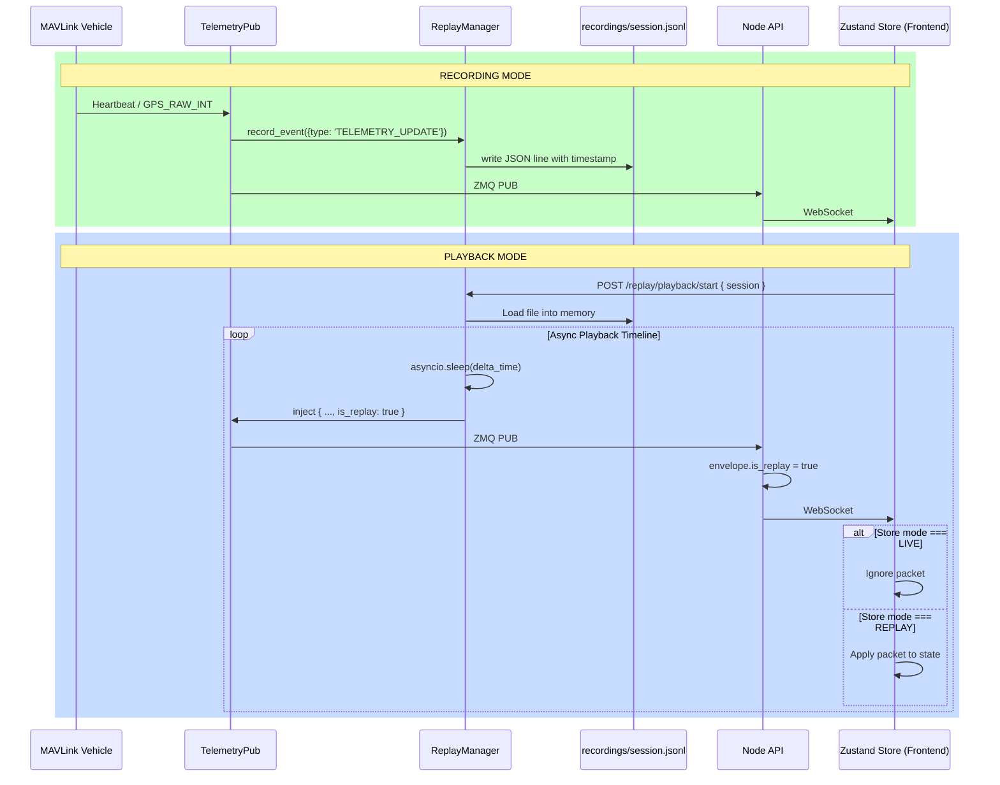

# Replay Event Flow

This diagram illustrates how live telemetry is captured to disk and later played back into the frontend stream without conflicting with live data.

```mermaid
sequenceDiagram
    participant MAV as MAVLink Vehicle
    participant ZMQ as TelemetryPub
    participant REC as ReplayManager
    participant DB as recordings/session.jsonl
    participant NODE as Node API
    participant REACT as Zustand Store (Frontend)

    %% Recording Flow
    rect rgb(200, 255, 200)
        Note over MAV, REACT: RECORDING MODE
        MAV->>ZMQ: Heartbeat / GPS_RAW_INT
        ZMQ->>REC: record_event({type: 'TELEMETRY_UPDATE'})
        REC->>DB: write JSON line with timestamp
        ZMQ->>NODE: ZMQ PUB
        NODE->>REACT: WebSocket
    end

    %% Playback Flow
    rect rgb(200, 220, 255)
        Note over MAV, REACT: PLAYBACK MODE
        REACT->>REC: POST /replay/playback/start { session }
        REC->>DB: Load file into memory
        
        loop Async Playback Timeline
            REC->>REC: asyncio.sleep(delta_time)
            REC->>ZMQ: inject { ..., is_replay: true }
            ZMQ->>NODE: ZMQ PUB
            NODE->>NODE: envelope.is_replay = true
            NODE->>REACT: WebSocket
            
            alt Store mode === LIVE
                REACT->>REACT: Ignore packet
            else Store mode === REPLAY
                REACT->>REACT: Apply packet to state
            end
        end
    end
```
