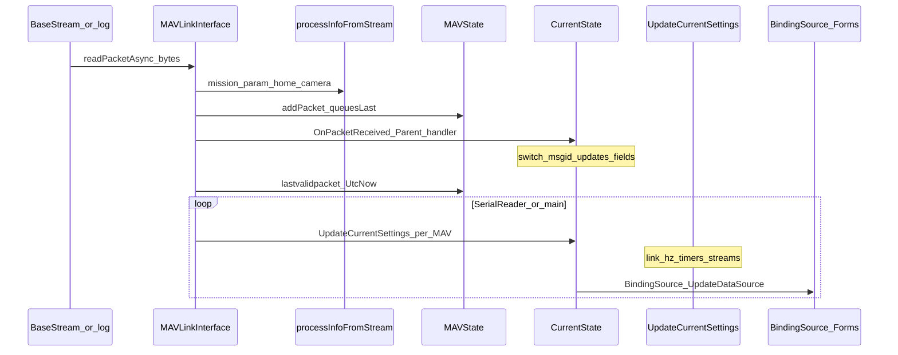

# Mission Planner — Telemetry state flow

End-to-end flow from **link bytes** to **`CurrentState`** fields and **UI binding**, including threading and periodic housekeeping. See [`mavlink-ingestion.md`](mavlink-ingestion.md) for parser/cache detail and [`vehicle-state-model.md`](vehicle-state-model.md) for `MAVlist` / `MAVState` roles.

## 1. Sequence diagram

## 2. Two parallel “outputs” of each packet

1. **Structured telemetry** → **`CurrentState`** (via **`Parent_OnPacketReceived`** and a few direct **`MAVlist[..].cs.*`** writes in **`MAVLinkInterface`** such as **`STATUSTEXT`**, **`HOME_POSITION`**).
2. **Protocol / mission / param caches** → **`MAVState`** (`wps`, `param`, `packets`, …) via **`processInfoFromStream`** and **`addPacket`**.

Both originate in **`readPacketAsync`** after a valid frame is assembled.

## 3. Packet ingestion → CurrentState (summary)

| Step | Component | Effect on telemetry state |
|------|-----------|---------------------------|
| Read + validate | `MAVLinkInterface.readPacketAsync` | Produces `MAVLinkMessage` |
| Side effects | `processInfoFromStream` | May set `cs.HomeLocation`, merge `PARAM_VALUE` into `MAVState.param`, update missions, etc. |
| Broadcast | `OnPacketReceived` | `CurrentState.Parent_OnPacketReceived` runs `switch(msgid)` |
| Direct edits | `readPacketAsync` body | e.g. `STATUSTEXT` → `cs.messages`, `messageHigh` |

## 4. Vehicle state synchronization

- **One `CurrentState` per `MAVState`** (per `sysid/compid`).
- **Active vehicle:** `MAVLinkInterface.MAV` → UI often uses `MainV2.comPort.MAV.cs`.
- **Multi-vehicle:** [`MainV2.SerialReader`](MissionPlanner/MainV2.cs) iterates **`port.MAVlist`** and calls **`MAV.cs.UpdateCurrentSettings(null, false, port, MAV)`** so **non-selected** vehicles still get periodic housekeeping (link %, timers, stream requests).

## 5. `UpdateCurrentSettings` in the flow

**Role:** bridge between **raw message rate** and **stable derived quantities** + **MAV_DATA_STREAM** maintenance.

- **Lock:** `lock (this)` on that `CurrentState` instance.
- **Rate cap:** ~50 ms between runs unless `updatenow`.
- **Work:** `linkqualitygcs` from MAV packet loss counters + `lastvalidpacket` staleness (10 s → 0%); per-second distance and air-time; optional wind calculation; **re-request datastreams** when `lastdata` gate fires; `csCallBack`; **`bs` delegate** for WinForms binding push.

## 6. UI synchronization mechanisms

| Mechanism | Typical thread | Role |
|-----------|----------------|------|
| **`OnPacketReceived`** | Reader / async continuation | Mutates `CurrentState` fields |
| **`UpdateCurrentSettings`** | UI or post-read | Derived values + `bs` callback |
| **`BindingSource.UpdateDataSource`** | UI (`BeginInvoke` in Flight Data) | Pushes `MAV.cs` snapshot to controls ~10 Hz |
| **Property setters on controls** | UI | e.g. HUD `Invalidate()` on change |

**Important:** Telemetry fields update **without** requiring a UI thread; **binding refresh** and **control painting** must run on the **UI thread** in WinForms.

## 7. Telemetry rates (requested vs observed)

- **Requested:** `CurrentState.rateattitude`, `rateposition`, `ratestatus`, `ratesensors`, `raterc` — defaults from static backups, reset in `ResetInternals`; sent via **`requestDatastream`** inside `UpdateCurrentSettings` when the ~8 s / `lastdata` gate opens (then `lastdata` advanced by 30 s to limit spam).
- **Observed:** `MAVState.packetspersecond[msgid]` EMA updated in `readPacketAsync` when sequence is valid.

## 8. Reconnection and session reset

- **Link close:** `connected` becomes false; no new packets; last values **linger** (no automatic nulling per field).
- **Reconnect / new session:** callers may invoke **`ResetInternals`** on `CurrentState` to clear telem-ish state and restore default stream rates.
- **New vehicle on link:** new `MAVState` + new `CurrentState`; subscriptions attached in ctor.

## 9. Stale telemetry handling

- **Link quality:** if no packet for **> 10 s** on that `MAVState`, `linkqualitygcs` forced to **0** in `UpdateCurrentSettings`.
- **Individual fields:** generally **not** time-stamped for expiry — UI shows **last known** attitude/GPS until the next message.
- **Alt / climb:** `alt` setter uses `datetime` spacing; `gotVFR` prefers VFR climb over finite-difference alt.

## 10. Event propagation

| Event | Publisher | Typical subscribers |
|-------|-----------|----------------------|
| **`OnPacketReceived`** | `MAVLinkInterface` | Every `CurrentState` whose `MAVState.parent` is this interface (filtered in handler) |
| **`csCallBack`** | `CurrentState` | Custom code subscribing to periodic post-derive hook |
| **`WhenPacketReceived` / `WhenPacketLost`** | Reactive subjects on interface | Diagnostics / plugins |

## 11. Separation: core vs WinForms

- **Core path:** bytes → `readPacketAsync` → `CurrentState` field updates (same types usable from headless automation if referenced as library).
- **WinForms-specific:** `BindingSource`, `UpdateDataSource`, `BeginInvoke`, designers — lives in GCS views, not in `CurrentState` itself.

---

*Architecture reference only; does not modify Mission Planner code.*
