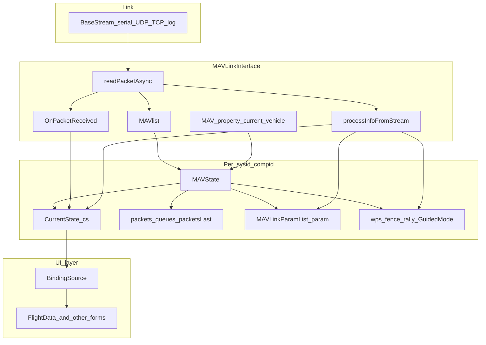

# Mission Planner — Vehicle state model

How **`MAVLinkInterface`**, **`MAVlist`**, **`MAVState`**, and **`CurrentState`** relate, how the **active vehicle** is selected, and how **UI binding** attaches. Complements [`currentstate-architecture.md`](currentstate-architecture.md) and [`telemetry-state-flow.md`](telemetry-state-flow.md).

## 1. Dependency diagram

**Parser note:** low-level framing/CRC lives in MAVLink helpers used by **`MAVLinkInterface`** (e.g. [`MavlinkParse`](MissionPlanner/ExtLibs/Mavlink/MavlinkParse.cs)); the interface owns **demux, caches, and events**.

## 2. Object roles

| Type | Responsibility |
|------|------------------|
| **`MAVLinkInterface`** | One **link** (port + options): read loop, send, **`MAVlist`**, current sys/comp, **`OnPacketReceived`**, logging, mirrors, param fetch APIs. |
| **`MAVlist`** (on interface) | Collection keyed by **`(sysid, compid)`** → **`MAVState`**. |
| **`MAVState`** | Per-vehicle **protocol + mission + param + proximity + camera** state; holds **`CurrentState cs`**, **`addPacket`** caches, **`lastvalidpacket`**, packet loss counters, **`packetspersecond`**. |
| **`CurrentState`** | Per-vehicle **decoded telemetry** for UI/speech/scripts; subscribes to **`OnPacketReceived`**; **`UpdateCurrentSettings`** for periodic work. |

## 3. Active vehicle (`MAV`)

- **`MAVLinkInterface.MAV`** is the **`MAVState`** for **`(sysidcurrent, compidcurrent)`** (exact accessor pattern in interface; conceptually “selected autopilot”).
- UI shortcuts: **`MainV2.comPort.MAV.cs`** — the **`CurrentState`** of the active vehicle.
- **Discovery:** first **`HEARTBEAT`** / **`HIGH_LATENCY2`** creates entries; if **`MAVlist.Count == 1`**, current ids may be set automatically.

## 4. What lives where (quick reference)

| Data | Primary holder |
|------|----------------|
| Latest roll/pitch/yaw, GPS fix, battery, SYS_STATUS bits | **`CurrentState`** |
| Waypoints, fence, rally, guided target | **`MAVState`** dictionaries / `GuidedMode` |
| Parameters | **`MAVState.param`** |
| Last raw packet of type N | **`MAVState.packets` / `packetsLast`** |
| Link quality inputs | **`MAVState`** loss counters + **`lastvalidpacket`**; **`CurrentState.linkqualitygcs`** computed in **`UpdateCurrentSettings`** |

## 5. UI binding path

- **Flight Data** (and other views) bind controls to **`CurrentState`** properties through **`BindingSource`** instances.
- **`UpdateDataSource`** is throttled in Flight Data (~10 Hz) to limit UI churn; **`SerialReader`** still calls **`UpdateCurrentSettings`** for **all** MAVs at a higher conceptual rate for housekeeping.

## 6. Vehicle state synchronization scenarios

| Scenario | Behavior |
|----------|----------|
| **Single copter on link** | One `MAVState`; often auto-selected as `MAV`. |
| **Multiple sysid/comp** | Each has `cs`; UI typically shows **`MAV.cs`**; other vehicles updated in background via **`UpdateCurrentSettings`** loop on all `MAVlist`. |
| **Log playback** | `logreadmode`; same `readPacketAsync` path with different byte source; GCS-originated packets may be skipped for further processing. |
| **Component messages** | `STATUSTEXT` from non-primary `compid` may be merged into current vehicle’s `messages` for display (see interface `STATUSTEXT` block). |

## 7. Connection and “connected” semantics

- **`CurrentState.connected`**: **`BaseStream != null && IsOpen`** **or** **`logreadmode`** on the parent interface.
- **`prearmstatus`** additionally requires **`connected`** in its getter.

## 8. Reset boundaries

- **`CurrentState.ResetInternals`**: clears telemetry-ish state and restores default **`rate*`**; invoked when establishing a clean session (callers vary).
- **New `MAVState`**: new **`CurrentState`** with fresh subscriptions when a new `(sysid,compid)` appears.

## 9. Separation recap

| Layer | Examples |
|-------|-----------|
| **Reusable backend** | `MAVlist` model, `MAVState` caches, `readPacketAsync` pipeline, `processInfoFromStream` extraction rules. |
| **WinForms-specific** | `BindingSource`, designers, `BeginInvoke`. |
| **Telemetry core** | `MAVLinkInterface` + `MAVState` + `CurrentState` + events — usable from non-UI tools if referenced as a library, though Mission Planner is WinForms-centric. |

---

*Architecture reference only; does not modify Mission Planner code.*
